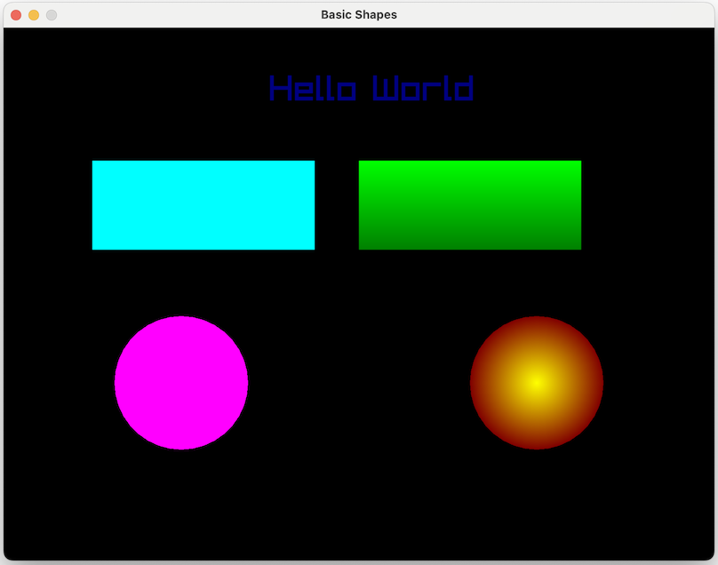

# Roc Ray Graphics Platform

[Roc](https://www.roc-lang.org) platform for building graphics applications, like games and simulations, while using the [Raylib](https://www.raylib.com) graphics library.

We aim to provide a nice experience for the hobby developer or a small team who wants to build a game or graphical application in Roc.

## Features

- Simple API for 2D & 3D graphics
- Built on the awesome Raylib library
- Cross-platform support for Linux, macOS, and Windows (hopefully Web coming soon)
- Write games using Roc, the Fast, Friendly, and Functional programming language
- Designed for beginners, hobby developers and small teams

## Documentation

Checkout the docs site at [lukewilliamboswell.github.io/roc-ray](https://lukewilliamboswell.github.io/roc-ray/)

## Example

(requires cloning the repository locally)

```roc
app [main, Model] { ray: platform "../platform/main.roc" }

import ray.RocRay

width = 800
height = 600

Model : {}

main : RocRay.Program Model []
main = { init, render }

init =

    RocRay.setWindowSize! { width, height }
    RocRay.setWindowTitle! "Basic Shapes"

    Task.ok {}

render = \_, _ ->

    RocRay.drawText! { text: "Hello World", x: 300, y: 50, size: 40, color: Navy }
    RocRay.drawRectangle! { x: 100, y: 150, width: 250, height: 100, color: Aqua }
    RocRay.drawRectangleGradient! { x: 400, y: 150, width: 250, height: 100, top: Lime, bottom: Green }
    RocRay.drawCircle! { x: 200, y: 400, radius: 75, color: Fuchsia }
    RocRay.drawCircleGradient! { x: 600, y: 400, radius: 75, inner: Yellow, outer: Maroon }

    Task.ok {}
```



## Getting Started

### Clone the repository

```
$ git clone https://github.com/lukewilliamboswell/roc-ray.git
```

### Linux and MacOS

*Required dependencies*
1. Install [roc](https://www.roc-lang.org)
2. Install [rust](https://www.rust-lang.org/tools/install)
3. Install dev tools on linux `sudo apt install build-essential git` or on macOS `xcode-select --install`
4. Install [just](https://github.com/casey/just?tab=readme-ov-file#packages)

Run an example:

```
$ just dev examples/pong.roc
```

**OR**

Use the [nix package manager](https://nixos.org/download/) to install the dependencies

```
$ nix develop
$ just dev examples/pong.roc
```

### Windows

1. Ensure you have [cargo](https://www.rust-lang.org/tools/install) in your path.
2. Install [just](https://github.com/casey/just?tab=readme-ov-file#packages)
3. Run `just setup` to download a windows build of Roc

Run an example:

``` 
PS > just dev .\examples\pong.roc
```

The unofficial Windows release of roc can be manually downloaded at [lukewilliamboswell/roc/releases/tag/windows-20241011](https://github.com/lukewilliamboswell/roc/releases/tag/windows-20241011)

```
PS > roc version
roc built from commit b5e3c3e441 with additional changes, committed at 2024-10-09 11:34:35 UTC
```


## Contributing

To run the tests locally:

```
$ ./ci/all_tests.sh
```

We are exploring how we can make a nice API for Roc and experimenting with different ideas, not quite a 1-1 mapping of the raylib API. We hope to find a nice balance between Roc's functional and Raylib's imperative style.

This platform is young, and there is a lot of work to do. You are welcome to contribute ideas or PR's, please let us know if you have any questions or need help.
