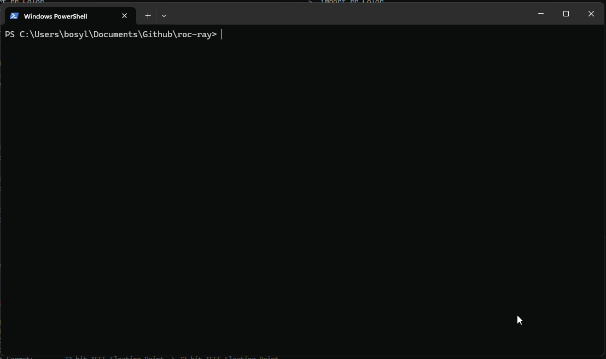

# RocRay Platform

A [Roc platform](https://www.roc-lang.org/platforms) for creating simple native graphics applications and games, built on [raylib](https://www.raylib.com/).



RocRay is an **experimental platform** that supports research and development of the Roc compiler. Its aim is to make simple games that demonstrate the benefits of the Roc language and of platform development. We expect the ideas here to be expanded in future, and contributions are welcome.

The goal isn't to build or support a large game engine. We're happy to help where it advances those aims — see [CONTRIBUTING.md](CONTRIBUTING.md) if you'd like to get involved.

> **Work in Progress:** This platform targets the new Roc compiler and Zig 0.16. Expect breaking changes and incomplete functionality.

> **Performance:** For the best performance, run your app with `roc build` (e.g. `roc build examples/breakout.roc`) rather than `roc <file>`. `roc build` uses the optimised LLVM backend, while running directly uses the in-development backends. This is expected to be a temporary limitation while the dev backends mature.

## Features

- 2D drawing primitives (styled rectangles, rounded rectangles, circles, lines, triangles, polygons, gradients, text)
- Asset loading for host-owned textures, with source/destination rectangles, rotation, origin, scale, and tint
- Pure 2D camera values with scoped world-space drawing
- Sprite helpers for spritesheet frames and simple frame-rate-based animation
- 2D math and collision helpers (Vec2, Rect, Circle, clamp, lerp, normalize, contains, overlaps)
- Tiled TMX tilemap loading, drawing, layer/object roles, solid queries, and object/property access
- Physics helpers backed by compact 3D PGA points, vectors, planes, lines, and translation motors
- RGBA colors with named constants, RGB/RGBA constructors, and hex helpers
- Explicit FPS/debug text drawing
- Text measurement, alignment helpers, long-string rendering, and custom font loading
- Mouse and keyboard input handling
- Loaded sound effects and generated procedural sounds with volume, pitch, and pan
- Streamed music playback with host-managed per-frame updates
- Native rendering via raylib (macOS, Linux, Windows)

## Requirements

- [Zig](https://ziglang.org/download/) 0.16.0
- [Roc](https://www.roc-lang.org/) (the pinned compiler commit is in [`ci/ROC_COMMIT`](ci/ROC_COMMIT))

## Quick Start

First, build the platform and cross-compile the pre-built host libraries for all supported targets:

```bash
zig build
```

Then build and run the hello world example:

```bash
roc build examples/hello_world.roc
./hello_world
```

> Use `roc build` (rather than `roc examples/hello_world.roc`) for the best performance — see the note above.

## Examples

Sprite and texture drawing:

```bash
roc build examples/sprites.roc
./sprites
```

World-space camera drawing:

```bash
roc build examples/camera.roc
./camera
```

Beginner game examples:

```bash
roc build examples/snake.roc && ./snake
roc build examples/breakout.roc && ./breakout
roc build examples/top_down.roc && ./top_down
roc build examples/cave_climb.roc && ./cave_climb
```

The top-down demo uses a Tiled-authored TMX map and selected CC0 assets from Kenney's Topdown Shooter, Impact Sounds, and Music Jingles packs; asset licenses are included under [`examples/assets/`](examples/assets/).

The cave climber demonstrates TMX tile layers, object roles, sprite sheets, camera following, and Physics distance checks with selected CC0 assets from Kenney's New Platformer Pack.

## Supported Targets

| Target | Description |
|--------|-------------|
| x64mac | macOS Intel |
| arm64mac | macOS Apple Silicon |
| x64glibc | Linux x64 |
| x64win | Windows x64 |

- We vendor the pre-compiled libraries from [raylib v6.0](https://github.com/raysan5/raylib/releases/tag/6.0)
- The default Linux bundle uses raylib's X11 build. A separate Linux x64 Wayland bundle can be created with `./bundle.sh --platform wayland` after building `vendor/raylib/linux-x64-wayland/libraylib.a`.
- ARM Linux is not available (raylib doesn't provide pre-built libraries)

## Contributing

RocRay exists to push on Roc compiler and platform development, so contributions that serve those aims are very welcome. See [CONTRIBUTING.md](CONTRIBUTING.md) for how to build the platform, run the test suite, regenerate glue bindings, and bundle a release.
