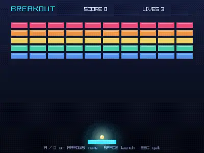
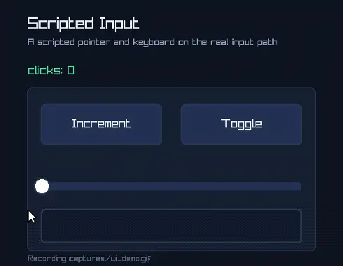
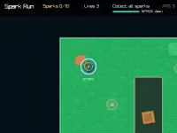
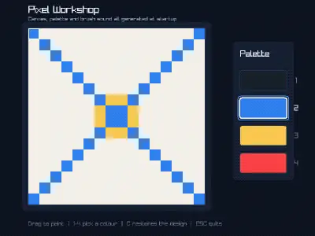
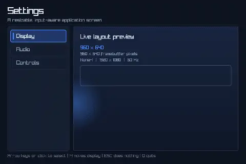
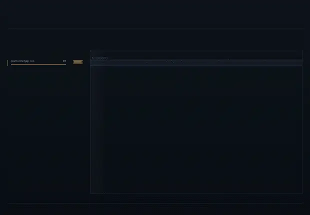

# RocRay

Build native games, visual tools, and interactive apps in
[Roc](https://www.roc-lang.org/), powered by
[raylib](https://www.raylib.com/).

RocRay is a focused app platform, not a game engine. Your app keeps its own
state and rules; RocRay provides drawing, audio, keyboard and mouse input,
windows, recording, files, and networking. It runs on macOS (Intel and Apple
Silicon), Linux x64, and Windows x64.

## See what it can do

These nine apps span small games, designed levels, creative tools, responsive
interfaces, and scenes with thousands of moving objects. Each tile links to its
complete Roc source; the [example guide](examples/README.md) covers the rest and
suggests a learning path.

<table>
  <tr>
    <td align="center"><a href="examples/cave_climb/main.roc"><br><strong>Cave Climb</strong></a><br>Designed level, jumping, camera, sound</td>
    <td align="center"><a href="examples/breakout/main.roc"><br><strong>Breakout</strong></a><br>Arcade rules, sounds made in code, recording</td>
    <td align="center"><a href="examples/capture_ui_demo/main.roc"><br><strong>Capture UI</strong></a><br>Automated controls and GIF recording</td>
  </tr>
  <tr>
    <td align="center"><a href="examples/top_down/main.roc"><br><strong>Top Down</strong></a><br>Designed map, characters, music, game states</td>
    <td align="center"><a href="examples/generated_assets/main.roc"><br><strong>Pixel Workshop</strong></a><br>Drawing pixels and creating sounds in code</td>
    <td align="center"><a href="examples/postcard_studio/main.roc"><br><strong>Postcard Studio</strong></a><br>Generative art and saving larger images</td>
  </tr>
  <tr>
    <td align="center"><a href="examples/responsive_ui/main.roc"><br><strong>Responsive Settings</strong></a><br>Keyboard, mouse, resizing, display scaling</td>
    <td align="center"><a href="examples/live_plot/main.roc"><br><strong>Live Plot</strong></a><br>Loading and drawing hundreds of thousands of lines</td>
    <td align="center"><a href="examples/particles/main.roc"><br><strong>Particles</strong></a><br>Thousands of moving images at once</td>
  </tr>
</table>

The capture examples also produce deterministic media directly, including this
[WebM plot recording](examples/gallery/capture_plot.webm).

## Try it

Install the Roc version named in [`.roc-version`](.roc-version), then run the
smallest example. The first line of the app downloads RocRay automatically:

```bash
git clone https://github.com/lukewilliamboswell/roc-ray.git
cd roc-ray
roc examples/hello_world/main.roc
```

Run examples from the repository root so asset paths resolve correctly. Use
`roc build` later when producing an optimized executable for distribution.

For your own project, copy the closest app from the
[example guide](examples/README.md). Each example downloads the matching RocRay
release automatically, so app authors need only Roc. Keep that RocRay release
and its matching Roc version together; the
[latest release](https://github.com/lukewilliamboswell/roc-ray/releases/latest)
provides both.

## The programming model

A RocRay app provides three functions:

- `init!` runs once. It sets the window options, loads what the app needs, and
  creates the starting state.
- `update!` handles input such as keys and mouse movement, then returns the next
  state.
- `render!` draws that state on the screen.

Reading a file or waiting for a network reply can take time. Start that work as
a task so the app can keep updating and drawing; when it finishes, `update!`
receives the result.

Read [`hello_world/main.roc`](examples/hello_world/main.roc) for the smallest
complete app, then choose a project from the
[example guide](examples/README.md). The
[API reference](https://lukewilliamboswell.github.io/roc-ray/) documents the
available features and functions.

## Project links

- [Examples and learning path](examples/README.md)
- [API reference](https://lukewilliamboswell.github.io/roc-ray/)
- [Latest release](https://github.com/lukewilliamboswell/roc-ray/releases/latest)
- [Architecture](design.md)
- [Contributing](CONTRIBUTING.md)

RocRay follows Roc's new compiler closely, and its APIs may still change as the
language evolves. Bug reports, documentation improvements, approachable APIs,
and focused capabilities are welcome.
