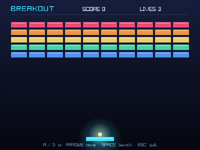
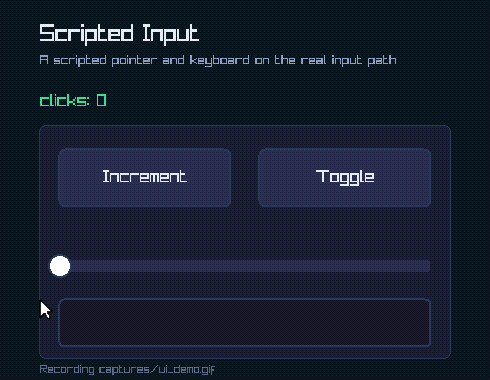
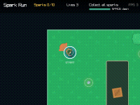
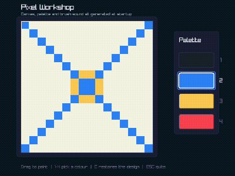
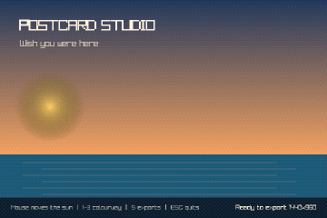
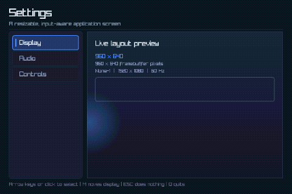
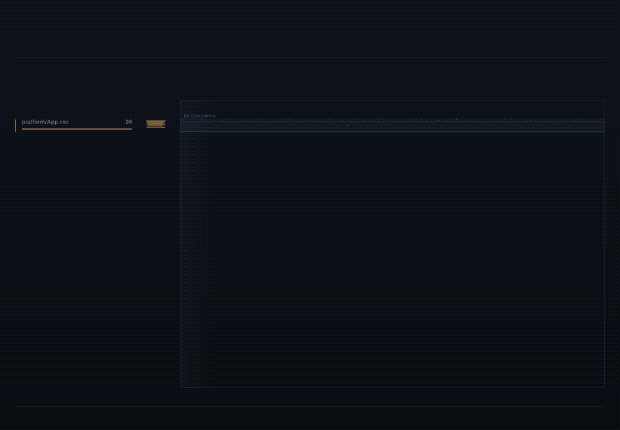
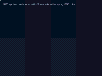

# RocRay

Build native games, visual tools, and interactive apps in
[Roc](https://www.roc-lang.org/), powered by
[raylib](https://www.raylib.com/).

RocRay is a focused app platform, not a game engine. Your app owns its model
and domain rules; RocRay supplies graphics, audio, input, windows, capture, and
selected access to files, networks, and other host facilities. It targets
macOS (Intel and Apple Silicon), Linux x64, and Windows x64.

## See what it can do

These nine apps span small games, authored worlds, creative tools, responsive
interfaces, and high-throughput rendering. Each tile links to its complete Roc
source; the [example guide](examples/README.md) covers the rest and suggests a
learning path.

<table>
  <tr>
    <td align="center"><a href="examples/cave_climb/main.roc"><br><strong>Cave Climb</strong></a><br>Tilemaps, platforming, camera, audio</td>
    <td align="center"><a href="examples/breakout/main.roc"><br><strong>Breakout</strong></a><br>Arcade rules, generated sound, capture</td>
    <td align="center"><a href="examples/capture_ui_demo/main.roc"><br><strong>Capture UI</strong></a><br>Scripted input, responsive controls, GIF capture</td>
  </tr>
  <tr>
    <td align="center"><a href="examples/top_down/main.roc"><br><strong>Top Down</strong></a><br>Authored world, sprites, music, game states</td>
    <td align="center"><a href="examples/generated_assets/main.roc"><br><strong>Pixel Workshop</strong></a><br>Generated assets and mutable textures</td>
    <td align="center"><a href="examples/postcard_studio/main.roc"><br><strong>Postcard Studio</strong></a><br>Generative art and high-resolution export</td>
  </tr>
  <tr>
    <td align="center"><a href="examples/responsive_ui/main.roc"><br><strong>Responsive Settings</strong></a><br>Keyboard, pointer, layout, HiDPI</td>
    <td align="center"><a href="examples/live_plot/main.roc"><br><strong>Live Plot</strong></a><br>Tasks and hundreds of thousands of lines</td>
    <td align="center"><a href="examples/particles/main.roc"><br><strong>Particles</strong></a><br>Thousands of batched sprites</td>
  </tr>
</table>

The capture examples also produce deterministic media directly, including this
[WebM plot recording](examples/gallery/capture_plot.webm).

## Try it

Install the Roc nightly named in [`.roc-version`](.roc-version) and
[Zig 0.16.0](https://ziglang.org/download/), then run the smallest example from
a source checkout:

```bash
git clone https://github.com/lukewilliamboswell/roc-ray.git
cd roc-ray
zig build
roc build examples/hello_world/main.roc --output hello_world
./hello_world
```

On Windows, run `hello_world.exe`. Build and run from the repository root so
example asset paths resolve correctly.

For your own project, start from the
[latest release](https://github.com/lukewilliamboswell/roc-ray/releases/latest).
Release bundles include the native host libraries, so app authors do not need
Zig or a raylib build. Pin the release and the Roc nightly it names together.

## The programming model

A RocRay app has three callbacks:

- `init!` configures the app and creates its model.
- `update!` folds one `App.Input` into the next model. It can call immediate
  host effects and start tasks for work that waits.
- `render!` draws the resulting model through a `Draw.Frame`.

Application callbacks and task bodies run serially on the frame thread. A task
parks while it waits and returns exactly one message on a later `App.Input`;
the host never runs Roc application code on a worker thread. Rendering stays
derived from the model instead of becoming a second update path.

Read [`hello_world/main.roc`](examples/hello_world/main.roc) for the smallest
complete app, then choose a project from the
[example guide](examples/README.md). The
[API reference](https://lukewilliamboswell.github.io/roc-ray/) documents every
module, type, and effect.

## Project links

- [Examples and learning path](examples/README.md)
- [API reference](https://lukewilliamboswell.github.io/roc-ray/)
- [Latest release](https://github.com/lukewilliamboswell/roc-ray/releases/latest)
- [Architecture](design.md)
- [Contributing](CONTRIBUTING.md)

RocRay follows Roc's new compiler closely, and its APIs may still change as the
language evolves. Bug reports, documentation improvements, approachable APIs,
and focused capabilities are welcome.
