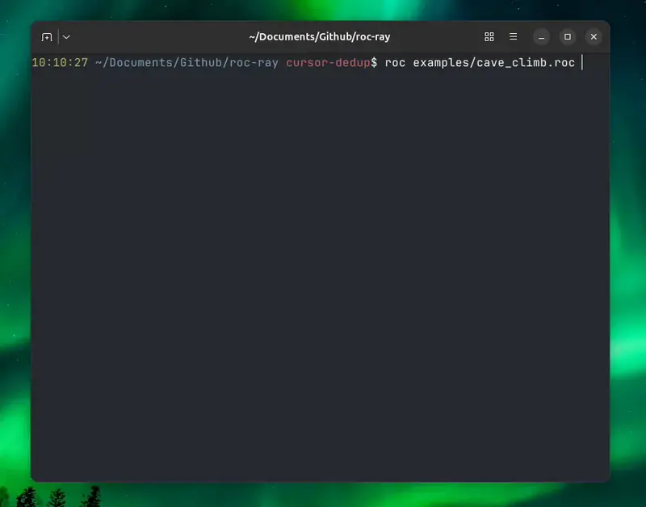

# RocRay

Make native games, visual tools, and interactive apps in [Roc](https://www.roc-lang.org/), powered by [raylib](https://www.raylib.com/).



*Cave Climb combines an authored tilemap, sprites, camera movement, collision
handling, sound, and mouse-driven tools.*

RocRay is intentionally simple: an app owns a model, updates it from the current
input snapshot, and draws a frame. It is not trying to become a large game
engine. Instead, it gives Roc apps a focused interface to raylib's broad set of
graphics, audio, input, windowing, and resource features.

RocRay is a usable app platform rather than a research experiment: release
bundles are tested on the supported systems, and the repository includes
complete games. It follows Roc's new compiler closely, so pin a RocRay release
and its matching Roc nightly together. RocRay APIs may still change as the
language evolves.

## Quick start

Install the Roc nightly named in [`.roc-version`](.roc-version) and
[Zig 0.16.0](https://ziglang.org/download/), then clone this repository and run
the smallest example against the local platform:

```bash
git clone https://github.com/lukewilliamboswell/roc-ray.git
cd roc-ray
zig build
roc build examples/hello_world/main.roc --output hello_world
./hello_world
```

On Windows, run `hello_world.exe`. Build from the repository root so example
asset paths resolve correctly.

Use `roc build` to produce a native executable. Running a source file directly
with `roc` uses Roc's in-development backend and is currently slower. Apps that
load files at runtime still need those assets distributed at the paths their
source expects.

Zig is not required to build apps with a released RocRay bundle. It is required
when using the local platform from a source checkout or changing the platform
itself.

## The app loop

A RocRay program has three callbacks. The model is the app state that survives
from one host cycle to the next:

- `init!` chooses the window configuration and creates the initial model.
- `update!` receives that model and a read-only `App.Input` -- this cycle's
  device snapshot, window snapshot, timing, and the messages finished tasks
  delivered -- and returns the next model, or `Err(Exit(code))` to stop. It is
  effectful: it calls host effects directly (`Window.set_clipboard_text!`,
  `Audio.Sound.play!`, ...) and starts deferred work with `Task.spawn!`.
- `render!` receives the model and a `Frame` used for drawing. It only draws;
  an effect that changes host state stops the app with a message naming the
  phase it belongs in.

Three rules say where an effect belongs, and the host enforces all three at
runtime. Anything that **changes host state** -- the cursor, the window, audio,
a recording, a texture's pixels -- runs from `init!`, `update!`, or a task.
Anything that **draws** runs only from `render!`. Anything that **waits** on a
file, a socket, or the clock runs only from `init!`, where it blocks startup on
purpose, or from a task, where it parks that task and the frame keeps going.
Break one and the app stops immediately with a message naming the effect, the
phase it was called from, and where it belongs.

Read the complete [`hello_world/main.roc`](examples/hello_world/main.roc) from top
to bottom to see this loop in the smallest complete app. Load long-lived
textures, sounds, fonts, shaders, and text that does not change during `init!`;
store them in the model and reuse them while rendering.

### Tasks

Work that finishes later never blocks the frame. A **task** is an effectful
closure that runs on its own coroutine alongside the frame loop; its return
value arrives as a message on a later `input.messages`. An effect that waits
inside it -- `Task.sleep!`, `Files.read_text!`, `Capture.screenshot!`,
`Http.send!` -- parks the task, not the frame:

```roc
Msg : [Woke]

Task.spawn!(input, || {
    Task.sleep!(300)
    Woke
})
```

The `input` is a witness that pins the closure's message type to your app's
`Msg`; `Task.spawn!` never reads it. Only the platform's `main.roc` can name
your `Msg` directly, so an `App.Input(Msg)` is how the rest of the API names it.

Inside the closure a waiting effect returns its answer, so a multi-step load
reads as straight-line code with `?` rather than a state machine spread over
`Msg` and `update!`:

```roc
Msg : [ConfigLoaded(Try(Str, Files.ReadTextError))]

Task.spawn!(input, || ConfigLoaded(Files.read_text!("config.txt")))
```

Apps do not allocate IDs, match raw responses, or maintain a batch. Messages
arrive in the order the tasks finished, and every task delivers exactly one.
The host runs 32 tasks at once and queues anything past that, starting each as
a slot frees, so `Task.spawn!` never refuses. See
[`async_read/main.roc`](examples/async_read/main.roc) for file reads,
[`live_plot/main.roc`](examples/live_plot/main.roc) for a paced directory walk,
[`task_sleep/main.roc`](examples/task_sleep/main.roc) for the smallest task, and
[`http_fetch/main.roc`](examples/http_fetch/main.roc) for a fetch that keeps the
frame moving while it waits.

## Start your own project

The easiest route is to copy one of the examples closest to what you want to
make. Hello World, Pong, Snake, and Breakout are self-contained; larger examples
keep their files in their own `assets/` directory. For a project outside
this checkout:

1. Copy the example directory, including its `assets/` and supporting modules.
2. If `main.roc` refers to `platform "../../platform/main.roc"`, replace that
   local path with the default `platform` declaration from the
   [latest release](https://github.com/lukewilliamboswell/roc-ray/releases/latest).
   Examples updated by the release workflow may already contain the bundle URL.
3. Build its `main.roc`.

Release bundles include the native host libraries, so app authors do not need
to build RocRay or raylib themselves. A bundle is the packaged Roc API plus
those libraries. Use the `.roc-version` from the bundle's release tag, which may
differ from the version required by the current source checkout.

Use the default bundle on macOS, Windows, and Linux through X11 or XWayland. A
separate native Wayland bundle is included in each release for Linux x64.

## What you can make

RocRay provides the pieces needed for much more than a minimal drawing demo:

- Styled 2D shapes, gradients, text, cameras, scissoring, blending, render
  textures, and shaders.
- Loaded or generated textures, spritesheet animation, mutable pixel data, and
  exact projective texture drawing.
- Explicit executable-relative, working-directory, or external disk asset
  stores with optional manifest identity validation; see the `Assets` module docs.
- Keyboard, mouse, Unicode text, gamepad, and cursor input.
- Window and frame timing, wall-clock timestamps, startup entropy, the
  [`roc-random`](https://github.com/kili-ilo/roc-random) generator package,
  command-line arguments, and environment access.
- File reads, writes, directory listings, and metadata; standard output and
  error for headless and batch runs; an embedded SQLite database; UDP sockets;
  and an HTTP client over the shared
  [`roc-lang/http`](https://github.com/roc-lang/http) `Request`/`Response`
  types, with TLS through the system certificate store. Everything that waits
  runs on a task while the frame keeps drawing.
- Generated or loaded sound effects plus streamed music with playback controls.
- 2D math and collision helpers, geometric-algebra helpers used for 2D gameplay,
  and TMX tilemaps with culled drawing and object queries.
- Resizable, fullscreen, VSync, capped, or uncapped native windows on macOS,
  Linux, and Windows.
- Screenshots and recordings an app takes of itself, written as PNG, animated
  GIF, or VP8 video in a WebM container, and PNG export of an offscreen render
  texture at any size.

Browse the [API reference](https://lukewilliamboswell.github.io/roc-ray/) for
individual functions and types.

## Recording an app

An app can capture its own output, which makes it a way to generate
documentation assets and visualizations rather than only to play them. Declare a
recording in the startup config and it needs no code in `render!` at all:

```roc
App.init(
    App.default
        .with_output_dir("captures")
    # Render on the GPU with no window on screen, like a batch job.
        .with_visible(Bool.False)
        .with_recording(
            Capture.default
                .with_path("demo.gif")
                .with_format(Gif)
                .with_fps(25)
                .with_max_frames(300),
        ),
    |_host| Ok({}),
)
```

`Capture.screenshot!`, `Capture.start!`, and `Capture.stop!` cover the cases
where the app decides when to capture. `Mouse.set_source` drives a
scripted pointer through the same input path a real one uses, so a recorded walk
through a UI exercises the app's ordinary hover and click handling.

Pixels also come back the other way. `Capture.pixel_at!` reads one pixel of the
last presented frame or of a `Draw.RenderTexture`, and `Capture.read_region!`
reads a rectangle of one as RGBA8 bytes -- an eyedropper, a golden-image check
a headless run makes itself, or an image-processing pass written in Roc.

Three things worth knowing:

- **Paths are sandboxed.** Every capture path resolves under `with_output_dir`.
  Absolute paths and paths containing `..` are refused rather than rewritten;
  this is the only file-writing capability the platform grants an app.
- **Recordings are reproducible.** `FixedStep` timing (the default) reports an
  exact `1/fps` frame delta regardless of how long the readback actually took,
  so a recording plays back smoothly and two runs produce identical output.
  Choose `RealTime` if you would rather see the true frame pacing.
- **A hidden window is not the same as `--host-headless`.** `with_visible(Bool.False)`
  still renders on the GPU, so captures work; it needs a display server, so wrap
  it in `xvfb-run` on a machine without one. The host's `--host-headless` flag swaps
  in a stub backend that draws nothing, so it captures nothing.

See `examples/postcard_studio/main.roc`, `examples/capture_plot/main.roc`, and
`examples/capture_ui_demo/main.roc`.

Separately, note that raylib's own screen-capture shortcut is compiled into the
vendored library: pressing **F12** in any RocRay app writes `screenshotNNN.png`
into the process working directory. That predates this feature, bypasses
`with_output_dir`, and cannot be disabled without rebuilding raylib from source.

## Examples

Breakout can generate a README-ready GIF after building the local host:

```bash
zig build
scripts/run-example.py examples/breakout -- --record-demo
```

The demo uses a hidden GPU window. On Linux without a display server, run the
last command through `xvfb-run -a`. Commit `examples/breakout/demo.gif`, then
add it to this section as a linked image card.

For a small game, start with Pong, Snake, or Breakout:

```bash
roc build examples/pong/main.roc --output pong && ./pong
roc build examples/snake/main.roc --output snake && ./snake
roc build examples/breakout/main.roc --output breakout && ./breakout
```

The larger showcase apps combine authored levels, sprites, sound, cameras, and
collision handling:

```bash
roc build examples/top_down/main.roc --output top_down && ./top_down
roc build examples/cave_climb/main.roc --output cave_climb && ./cave_climb
```

In Cave Climb, use A/D to move, W, Up, or Space to jump, the left mouse button
to fire the laser, and the right mouse button to use the hook.

The [example gallery](examples/README.md) groups complete starter apps, larger
showcases, and focused recipes. It also suggests a learning path and calls out
the reusable patterns in each app, including responsive UI, input, cameras,
generated assets, projective textures, post-processing, and capture workflows.

## Supported systems

| System | Architecture |
| --- | --- |
| macOS | Intel and Apple Silicon |
| Linux | x64 (X11/XWayland or native Wayland bundle) |
| Windows | x64 |

ARM Linux is not currently included in release bundles.

## Contributing

Bug fixes, approachable APIs, documentation, examples, and well-scoped new
capabilities are welcome. Read [CONTRIBUTING.md](CONTRIBUTING.md) for the
development setup, design principles, tests, and release tooling.
