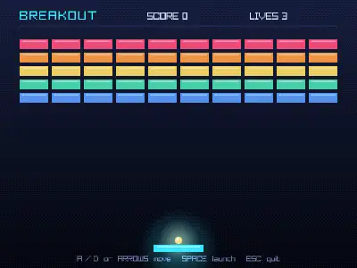
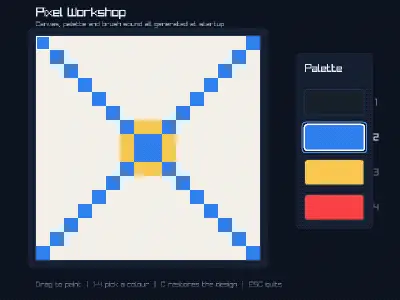
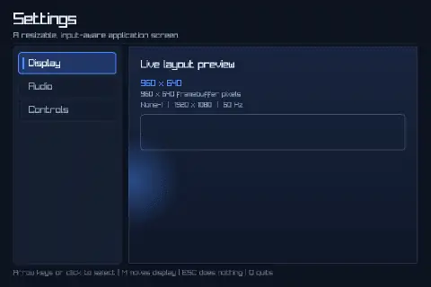
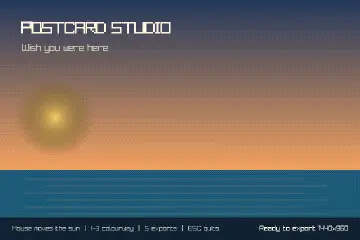
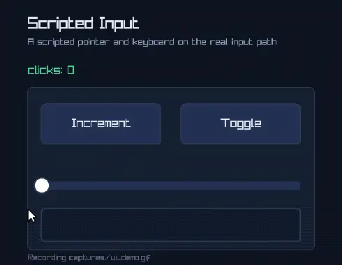
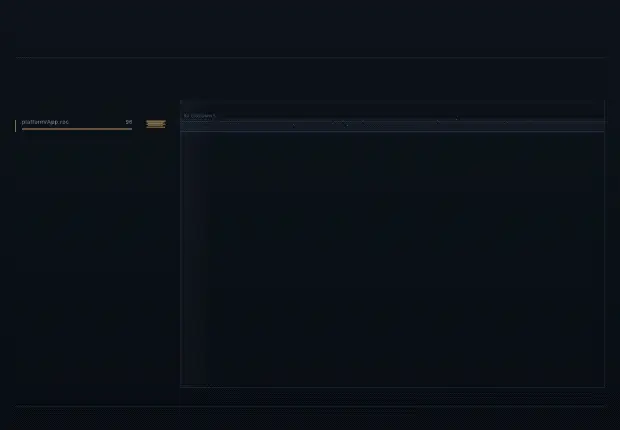
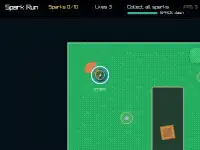
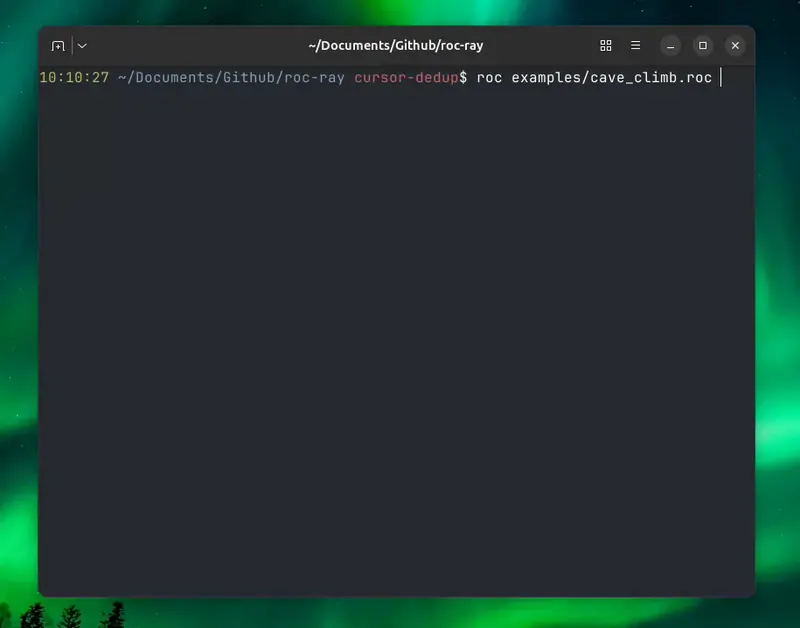

# RocRay

Make 2D games, visual tools, and interactive apps in
[Roc](https://www.roc-lang.org/), powered by
[raylib](https://www.raylib.com/).

RocRay is a focused app platform, not a game engine. Your app keeps its own
state and rules; RocRay provides drawing, sound, keyboard, mouse and gamepad
input, the window, recording, files, and networking. It runs on macOS (Intel
and Apple silicon), Linux x86-64, and Windows x86-64.

Start with [Hello World](examples/hello_world/main.roc),
[Pong](examples/pong/main.roc), and [Snake](examples/snake/main.roc). These
larger examples show what else it can do:

<table>
  <tr>
    <td align="center"><a href="examples/breakout/main.roc"><br><strong>Breakout</strong></a><br>Arcade rules, sounds made in code, recording</td>
    <td align="center"><a href="examples/generated_assets/main.roc"><br><strong>Pixel Workshop</strong></a><br>Drawing pixels and creating sounds in code</td>
    <td align="center"><a href="examples/responsive_ui/main.roc"><br><strong>Responsive Settings</strong></a><br>Keyboard, mouse, resizing, display scaling</td>
  </tr>
  <tr>
    <td align="center"><a href="examples/postcard_studio/main.roc"><br><strong>Postcard Studio</strong></a><br>Generative art and saving larger images</td>
    <td align="center"><a href="examples/particles/main.roc"><br><strong>Particles</strong></a><br>Thousands of moving images at once</td>
    <td align="center"><a href="examples/capture_ui_demo/main.roc"><br><strong>Capture UI Demo</strong></a><br>Automated controls and GIF recording</td>
  </tr>
  <tr>
    <td align="center"><a href="examples/live_plot/main.roc"><br><strong>Live Plot</strong></a><br>Loading and drawing hundreds of thousands of lines</td>
    <td align="center"><a href="examples/top_down/main.roc"><br><strong>Spark Run</strong></a><br>Designed map, characters, music, game states</td>
    <td align="center"><a href="examples/cave_climb/main.roc"><br><strong>Cave Climb</strong></a><br>Designed level, jumping, camera</td>
  </tr>
</table>

## Try it

1. Install the Roc compiler named in the notes of the
   [0.10.0-rc6 release](https://github.com/lukewilliamboswell/roc-ray/releases/tag/0.10.0-rc6),
   as [Getting started](docs/getting-started.adoc#install) describes.
2. Download that release's
   [example starter](https://github.com/lukewilliamboswell/roc-ray/releases/download/0.10.0-rc6/examples-0.10.0-rc6.zip)
   and unzip it.
3. Open a terminal in the extracted directory, the one containing `examples/`,
   and run:

```bash
roc version
roc examples/hello_world/main.roc
```

## A whole app

A red circle that follows the mouse. Replace `BUNDLE-URL` and `COMPILER` with
the default bundle URL and the compiler the release notes name.

```roc
app [Model, program] { rr: platform "BUNDLE-URL", roc: "COMPILER" }

import rr.App
import rr.Color
import rr.Draw

Model : { pointer : { x : F32, y : F32 } }

Msg : []

program = { init!, update!, render! }

init! : App.Init(Model, [])
init! = App.init(App.default.with_title("Hello"), |_io| Ok({ pointer: { x: 400, y: 300 } }))

update! : Model, App.Input(Msg), App.Io => Try(Model, [Exit(I64)])
update! = |_model, input, _io| Ok({ pointer: input.devices.mouse.position() })

render! : Model, Draw.Frame => Try({}, [Exit(I64)])
render! = |model, frame| {
    frame.clear!(Color.black)
    frame.circle!({ center: model.pointer, radius: 40, style: Draw.filled(Color.red) })
    Ok({})
}
```

`init!` creates the starting state, `update!` turns each moment's input into
the next state, and `render!` draws it. Work that waits, such as reading a
file or fetching a URL, runs as a task and reports back to a later `update!`.
What an app reaches beyond its own window -- the network, a directory, another
program -- is declared in its startup settings.

## Documentation

The [RocRay manual](https://lukewilliamboswell.github.io/roc-ray/manual/) is
published as a website and a PDF. Its chapters are the AsciiDoc files in
[`docs/`](docs/), which you can also read here:

- [Getting started](docs/getting-started.adoc): install, run an example, and
  write the smallest app
- [Roc for RocRay](docs/roc-primer.adoc): the Roc a small app uses
- [Your first game](docs/first-game.adoc): build a small game in six steps
- [Example gallery](docs/examples.adoc): what each example shows, and a
  learning path
- Guides: [the app model](docs/app-model.adoc), [input](docs/input.adoc),
  [drawing](docs/drawing.adoc), [tasks](docs/tasks.adoc),
  [declaring what an app reaches](docs/permissions.adoc),
  [files and assets](docs/files-and-assets.adoc), [audio](docs/audio.adoc),
  [HTTP and UDP](docs/networking.adoc), [capture](docs/capture.adoc),
  [testing](docs/testing.adoc), and [performance](docs/observatory.adoc)
- [Glossary](docs/glossary.adoc)
- [API reference](https://lukewilliamboswell.github.io/roc-ray/)
- [Architecture](docs/architecture.adoc)
- [Contributing](docs/contributing.adoc)
- [Release notes](docs/releases/) and the
  [releases page](https://github.com/lukewilliamboswell/roc-ray/releases)

RocRay follows Roc's newest compiler closely, and its API may still change as
the language evolves. Bug reports, documentation improvements, and focused new
capabilities are welcome.
