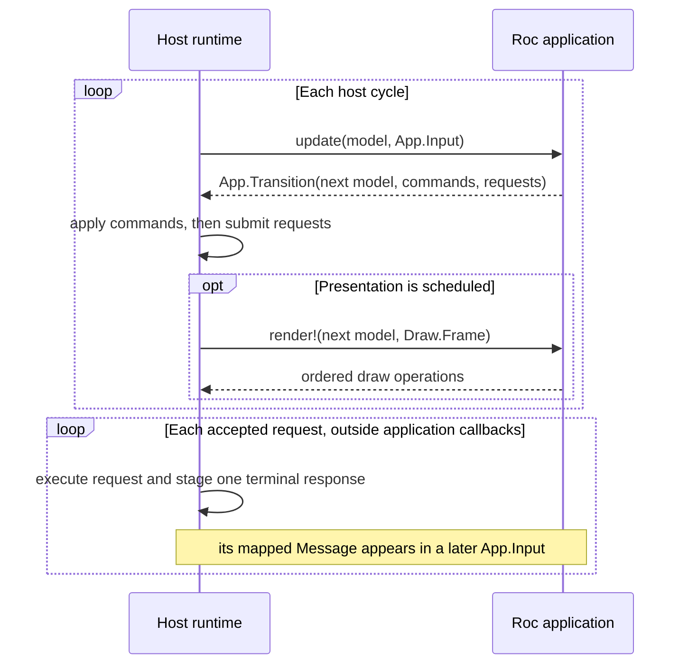

# RocRay architecture

> **Status (2026-08-22):** the `App.Transition` / `App.Command` design
> described below has been superseded on branch `spike-coro` by an effectful
> `update!` with direct host effects, `Task.spawn!` coroutine tasks, and a
> runtime phase guard -- see `COROUTINE_DESIGN_PROPOSAL.md`. `App.Request`
> and its response messages still work as described here until step 6 of that
> proposal replaces them. The sections on commands, the apply phase, and the
> command-coverage invariant describe the previous design.

## Purpose of this document

This document defines RocRay's intended end-state architecture. It is a design
contract: the stable requirements, system boundaries, invariants, and reasons
that should govern both the current implementation and future features.

It is not an API reference, implementation tour, test inventory, or delivery
plan. Those change as the project develops. Public module documentation
describes the current API, [`CONTRIBUTING.md`](CONTRIBUTING.md) describes the
current implementation workflow, and the
[GitHub issues](https://github.com/lukewilliamboswell/roc-ray/issues) describe
candidate work and delivery order.

This document should change only when a requirement changes, experience
invalidates an assumption, or the project deliberately moves a system
boundary. Adding a draw primitive, input source, request kind, resource type, or
target should not by itself require an architecture change.

## Product definition

RocRay is a focused Roc application platform for games, visualizations,
creative tools, explainers, and other interactive or frame-oriented programs.
It supplies graphics, audio, input, window or surface management, capture, and
selected access to external systems through a disciplined boundary between a
Roc application and a host runtime.

RocRay is deliberately smaller than a game engine or application framework.
The application owns its model and domain rules. Libraries and application
code may build scene graphs, entity systems, UI toolkits, physics worlds,
network protocols, or asset pipelines, but the platform does not prescribe or
retain those abstractions. Its job is to make host facilities safe, explicit,
bounded, testable, and efficient.

The current host uses raylib, but raylib is an implementation dependency rather
than the application-facing architecture. A different native backend, a
browser callback loop, or a non-rendering test host must be able to preserve
the same application contract.

## Vocabulary and prior art

RocRay is closest to a synchronous state transducer embedded in a game loop. It
is informed by The Elm Architecture, but it is not a browser UI runtime: it
samples several host facilities together, applies ordered device commands, and
renders immediately to a frame.

The vocabulary deliberately follows established meanings:

| RocRay term | Meaning |
| --- | --- |
| `Model` | Application-owned state retained between host cycles |
| `App.Input(msg)` | Everything supplied to one state transition: sampled host state, interval events, and response messages |
| `update` | The pure transition function |
| `App.Transition(model, msg)` | The next model and the host work requested by that transition |
| `App.Command` | An ordered, current-host-cycle instruction that produces no response |
| `App.Request(msg)` | One finite request that produces exactly one later response message while the application remains alive |
| application `Message` or `msg` | Application data produced from a request response and delivered in a later `Input` |
| `Draw.Frame` | Render-scoped authority for the active drawing surface |
| host cycle | One `App.Input`, one call to `update`, command application, request submission, and optional presentation |
| simulation step | Application-defined domain advancement performed zero or more times within one `update` |
| presentation frame | One call to `render!` using the latest model |

Names are selected by direction, timing, cardinality, and ownership rather than
by the current implementation. A familiar term is preferred when it predicts
those properties; a qualified familiar term is preferred to a novel one when
two domains use the same word differently. This is the terminology test for
future concepts as well as the rationale for the current names.

Several words have precise meanings throughout this document:

| Word | Meaning here |
| --- | --- |
| bounded | The maximum host-retained items or bytes is known before admission; it need not be small or globally constant |
| capability | An unforgeable typed value granting limited authority over a host facility or resource; possession does not guarantee a successful runtime outcome |
| domain state | Application-meaningful state that determines behavior or policy, as distinct from a host facility's operational state |
| terminal response | The single success, error, cancellation, or refusal that completes one request; that request produces nothing afterward |

This is the conventional state-machine relationship: current state plus input
determines next state plus output. A Mealy machine is formally a state machine
that produces output for each transition; RocRay's transition outputs are
commands and requests, while rendering is separately derived from the resulting
model. See the [definition of a Mealy machine](https://en.wikipedia.org/wiki/Mealy_machine).

The names also account for conventions that conflict across software domains:

- [The Elm Architecture](https://guide.elm-lang.org/architecture/) uses
  `Model`, `update`, messages, and command values that may eventually produce a
  message. RocRay retains the names whose meanings match, but splits outbound
  work by response cardinality: `Request` expects one; `Command` expects none.
- [CQRS](https://learn.microsoft.com/en-us/azure/architecture/patterns/cqrs)
  also uses *command* for an instruction that changes state, in contrast to a
  query that returns data. RocRay makes the no-response property explicit.
- Graphics APIs also use *command* for ordered instructions submitted for
  execution; for example, the
  [Vulkan specification](https://docs.vulkan.org/spec/latest/chapters/cmdbuffers.html)
  defines command buffers this way. RocRay commands are ordinary Roc data, not
  public GPU command buffers, but the direction and ordering intuition match.
- [Redux](https://redux.js.org/tutorials/fundamentals/part-2-concepts-data-flow#actions)
  calls an inbound event an *action*, while
  [XState](https://stately.ai/docs/actions) calls an outbound fire-and-forget
  effect an *action*. RocRay uses *command* so direction is not framework-
  dependent.
- In mainstream async APIs, such as
  [Python `asyncio`](https://docs.python.org/3/library/asyncio-task.html#awaitables),
  a *task* is scheduled or running work with identity and cancellation.
  RocRay's value is an inert declarative request with no public identity, so
  *request* better predicts its lifecycle.
- A *step* conventionally suggests advancing a simulation. Game loops often
  distinguish variable-rate frame processing from fixed-rate physics steps, as
  illustrated by
  [Godot's processing model](https://docs.godotengine.org/en/4.6/tutorials/scripting/idle_and_physics_processing.html).
  One RocRay cycle may cause the application to perform zero, one, or several
  simulation steps, so the value supplied to `update` is an *input*, not a
  `Step`.
- *Commit* commonly implies an atomic or durable transaction. RocRay only
  applies commands in order, so the phase is called *apply*.

`Step`, `Action`, `Task`, and `Update` are therefore not synonyms retained for
variety. They name different concepts elsewhere and are not used for these
public roles. Likewise, `Context` is avoided because framework contexts usually
carry capabilities or services, whereas `App.Input` carries data only. A
transition containing only a next model is constructed as `App.next(model)`;
*static* would falsely imply that the model did not change.

## Design goals

### Simple application reasoning

An application should be understandable as a model transformed by a stream of
complete observations, with requested effects stated as data. There is one
place for domain state transitions and no hidden platform callback that can
mutate the model.

### Testability and controlled reproducibility

Application rules should be testable without a window, GPU, audio device,
filesystem, network, or worker thread. Sources of nondeterminism must cross the
application boundary explicitly so an application can replace, record, or
control them when reproducibility matters.

### Frame-time discipline under load

Known blocking filesystem, network, process, and waiting operations do not run
inside the host cycle. The amount of synchronous work introduced by the
platform is bounded before it is admitted. Frame-scoped GPU and audio calls can
still stall in a driver, so RocRay does not claim hard real-time deadlines.
Saturation has deliberate semantics rather than causing unbounded retained
work or silent response loss.

### Efficient boundary crossings

The expensive unit is often a Roc/host transition, allocation, copy, or thread
handoff rather than the primitive operation behind it. APIs should move
compact batches and snapshots across the boundary and let each side loop over
the representation it owns.

### Honest portability

The application contract must not assume who drives the event loop or how the
host schedules work. A target exposes an explicit capability profile. Features
with no sound implementation on that target are absent from its profile rather
than accepted and failed mysteriously at runtime.

When these goals conflict, correctness, explicit ownership, boundedness, and
clear semantics take priority over API breadth and peak benchmark results.

## The system boundary

Ownership has two meanings at this boundary. *Semantic authority* means deciding
what a value means and how it changes. *Runtime custody* means retaining its
representation and eventually releasing it. The two must not be conflated.

Each layer has a distinct responsibility:

| Layer | Semantic authority | Runtime custody |
| --- | --- | --- |
| Roc application | Domain model, policy, interpretation of input, requested work | Ordinary Roc values reachable from the model and transition |
| Pure Roc packages | Reusable vocabulary and algorithms | Their ordinary values, but no live host facility merely by defining its type |
| Platform adapter | Public transition, command, request, and frame protocols | Values moving between the application and host ABI |
| Host runtime | Cycle ordering, sampling policy, request execution, capacity, shutdown | The opaque model between callbacks, response mappers, and native resources |
| Backend and operating system | Device and operating-system behavior | Windows or surfaces, files, processes, sockets, GPU state, and audio state |

The application has semantic authority over its model. The host has custody of
the model between callbacks but treats it as opaque. It does not inspect the
model to infer rendering, input interest, resource reachability, or domain
decisions.

Internal transport records, callback tickets, resource slots, native pointers,
and backend objects do not cross the public boundary. Public opaque values are
typed capabilities, not escape hatches into host memory.

## The application contract

A RocRay program has three responsibilities:

- `init!` validates startup configuration, performs one-time startup effects,
  and creates the initial model. Startup may load or allocate resources before
  interactive cycling begins.
- `update` receives the current model and one `App.Input`. It returns an
  `App.Transition` containing the next model, commands, and requests. It is
  pure.
- `render!` receives the resulting model and a `Draw.Frame`. It may issue
  drawing commands and frame-scoped draw-state changes, but it cannot change
  the model or request general host work.

Conceptually, the host drives this cycle:

The ordering is intentional: the host constructs one input, `update` computes
one transition, commands are applied in list order, requests are submitted in
list order, and any presentation sees the new model after command application.
A host may implement this with a native loop, a browser callback, or another
scheduler; the observable contract remains the same.

### Host cycles, simulation steps, and presentation

A host cycle supplies one fresh `App.Input` and invokes `update` exactly
once. After applying the resulting commands and submitting its requests, the
host may invoke `render!` at most once with the resulting model. A graphical
host normally presents every cycle; a headless, minimized, or deliberately
throttled host may omit presentation.

A simulation step is application-defined rather than a platform callback. An
application may advance its domain simulation zero, one, or several times
during one `update`, accumulating commands and requests in their intended
order. Only the final model is available for presentation.

The host does not invoke `update` repeatedly with the same input to catch up.
Each interval event and request response is therefore consumed by exactly one
transition. Simulation pacing, catch-up limits, and overload policy remain
explicit application policy.

Repeated calls to `update` within one host callback would not by themselves
create concurrency, yield to host work, or allow a request response to arrive
between calls. Independently scheduled transitions would require new input,
effect-ordering, and overload semantics, so adding them is an architecture
change rather than a host optimization.

Roc application callbacks execute serially. The host never concurrently
touches the same Roc application value from multiple threads. Roc values have
immutable value semantics. Explicit mutable variables may be reassigned, as
described in Roc's [functional programming
guide](https://roc-lang.org/functional), and the compiler may reuse uniquely
owned storage, but aliases do
not thereby observe an existing value change. Runtime representations can
nevertheless contain mutable ARC metadata, so unsynchronized threads sharing
the same value could race while updating its reference count. Serial callbacks
also give applications one unambiguous order of model transitions.

The platform cannot prevent application code itself from taking too long, but
no runtime effect exposed to `update` or `render!` may turn those callbacks into
blocking I/O entry points. Long-running work belongs to the host and returns on
a later host cycle.

## Boundary protocols

The application and host interact through five explicit protocols. They are
separate because they have different direction, timing, cardinality, and
failure semantics.

| Protocol | Direction | Timing and cardinality |
| --- | --- | --- |
| Startup authority | Host to `init!`, with direct startup operations | Once, before cycling |
| `App.Input(msg)` | Host to `update` | Exactly once per host cycle |
| `App.Command` | `update` to host | Zero or more, applied this host cycle, no response |
| `App.Request(msg)` | `update` to host and one response message back | Zero or more; response delivered in a later input |
| `Draw.Frame` | Host to `render!`, with draw calls back to host | Zero or one per host cycle; exactly one per presentation frame |

Adding a sixth protocol is an architecture change. Adding a new value carried
by one of these protocols is ordinarily an API change only.

### Input: `App.Input(msg)`

`Input` is immutable data supplied to one call of `update`. It contains three
kinds of information, which are not falsely presented as one atomic operating-
system snapshot:

- **state samples** report the latest value at the cycle boundary, such as
  held keys, surface dimensions, focus, and recording status;
- **interval events** report ordered occurrences retained since the preceding
  input, such as presses, text, dropped files, or touch transitions;
- **messages** are application values produced by mapping request responses in
  the order the host observed them.

The contained keyboard, pointer, touch, and gamepad snapshot is named
`devices`, not `input`. This keeps `App.Input` distinct from one category
inside it and avoids the unhelpful expression `input.input` in application
code.

Every input field documents which kind it is, when it is sampled, its ordering
and coalescing rules, and its finite capacity. A bounded event source either
reports overflow explicitly or documents that it is intentionally lossy and
what is coalesced. “Latest value” is sufficient for state; silently losing an
edge or response is not equivalent.

If application logic needs an answer, that answer arrives as input data.
General host reads inside `update` would make the transition effectful and let
two reads during one transition disagree.

Continuously changing sources have two valid shapes. Ambient sources such as
device input are sampled or buffered into `Input`. Demand-driven sources such
as a socket or database cursor can instead expose repeated finite requests.
Neither shape invokes application code from a background thread.

### Current-cycle instructions: `App.Command`

A command is closed, inspectable data describing an ordered host instruction
to apply after `update` and before rendering. It is appropriate when relative
order matters and the application needs no response.

Commands have these properties:

- every structurally valid command is invoked exactly once in list order;
- they contain no arbitrary effectful closure;
- their comparable descriptions can be inspected in pure tests without
  inspecting opaque host resources;
- they do not produce callbacks or immediate results;
- every apply-phase hosted operation is reachable through a command or has a
  documented reason why it is not application-reachable.

A command's verb states the strength of its guarantee. `Set` is reserved for a
state change the capability profile promises to apply; a window-manager hint,
for example, is named `Suggest` rather than pretending the host controls the
final geometry. If success or failure itself changes application policy, the
operation is a request or exposes later status in `App.Input`.

That last rule is the command-coverage invariant. An apply-capable hosted
operation without a corresponding command is dead public API: `update` cannot
call it and `render!` must not. Coverage is mechanically checked.

Invoking a command and observing a physical outcome are different guarantees.
Device commands can be subject to documented backend behavior, but a condition
the model must distinguish makes the operation a request or requires later
status in `Input`. Capacity exhaustion is not a reason to silently drop a
command. Purely checkable structural errors are rejected before any command in
the transition is invoked.

### Finite request/response work: `App.Request(msg)`

A request is inert, declarative data describing one finite operation. It
carries a pure response mapper from the operation's typed result into an
application message. The host owns correlation; applications never allocate
transport tickets, match raw responses, or inspect a global registry.

Finite describes response cardinality, not a universal wall-clock deadline.
An operation that can wait indefinitely on an external party defines a
deadline, cancellation, or capability-lifecycle operation so the host can
eventually release its reservation without abandoning the response mapper.

During an orderly application lifetime, every submitted request produces
exactly one response message. Rejection because capacity is exhausted is
itself a response such as `Busy`; it is not a dropped request. This invariant
means a component can account for every request it emitted without public IDs,
timeouts invented only to detect host loss, or callbacks stranded forever.

Exactly one response is an in-process bookkeeping guarantee, not a claim of
exactly-once execution by a filesystem, network peer, database, or subprocess.
An external side effect may have occurred even when its outcome is an error;
safe retry and idempotency remain application or protocol policy.

Accepted asynchronous work reserves the resources needed both to execute and
to stage its response. A request that cannot obtain that reservation is refused
with an immediate terminal response. Applications that want less concurrency
than the platform permits pace requests in their pure model.

Requests are submitted in list order after all commands have been applied, but
independent requests may respond in any order. Required dependencies are
expressed by submitting a later request only after the earlier response has
entered the model.

Orderly shutdown is the deliberate exception to response delivery: no future
`Input` exists, so pending response mappers are released while host work is
cancelled, joined, or cleaned up according to its contract. Forced process
termination and catastrophic host failure are outside the in-process delivery
guarantee.

### Rendering: `Draw.Frame`

`Frame` is a render-scoped capability rather than general application input.
It permits ordered drawing and draw-state changes only while the host's current
surface scope is open.

Rendering may query narrowly frame-relative facts such as the dimensions of
the active surface or metrics of a draw resource. Such a query may influence
drawing only. Anything that must affect the next model, hit testing, commands,
or requests also needs a representation in `App.Input`.

### Choosing a protocol

| Need | Protocol |
| --- | --- |
| Latest ambient state or bounded interval events | `App.Input` field |
| Finite work whose terminal outcome matters | `App.Request(msg)` |
| Ordered current-host-cycle instruction with no response | `App.Command` |
| Drawing or draw state ordered within a frame | `render!` and `Draw.Frame` |
| One-time blocking load or allocation | `init!` startup authority |

The classification follows semantics, not backend convenience. An operating-
system function being synchronous does not make it safe to expose as a
synchronous application operation.

## Cycle ordering and capability enforcement

Each host cycle has a fixed logical order:

1. The host constructs `App.Input`.
2. Pure `update` computes one `App.Transition`.
3. The platform validates the complete transition and applies its commands in
   list order.
4. The host submits its requests in list order. Even a response available
   immediately is staged for a later input.
5. If presentation is scheduled, the host calls `render!` with the resulting
   model and an open `Draw.Frame`, then closes the frame.
6. The host performs bounded housekeeping.

This is ordering, not transactionality. Commands may have physical effects as
they are invoked; RocRay does not claim that a driver or operating system can
roll them back. Validation before application prevents purely structural
errors from causing a knowingly partial cycle.

The conceptual application phases and the host's dynamic enforcement scopes
are related but not identical:

| Application phase | Allowed public behavior | Enforcement |
| --- | --- | --- |
| Startup | Direct one-time startup operations | Startup capability plus host phase checks |
| Transition | Pure construction of next model, commands, and requests | Public API exposes no hosted operation to `update` |
| Apply | Interpretation of returned commands | Private adapter plus host phase checks |
| Render | Drawing and render-scoped queries | `Draw.Frame`, structured scopes, and host phase checks |
| Host service | Request execution, response staging, cleanup, shutdown | No application callback and no worker access to Roc values |

Capabilities can outlive the callback that supplied them, so possession of a
value alone is not authority to use it in every phase. Every hosted operation
that can actually be invoked is checked against its dynamic host scope; purity
of `update` is primarily a public-surface guarantee rather than a fictional
hosted `Update` phase.

Direct loading and allocation are startup-only because they may block, touch a
driver, or return a new capability. Runtime loading is a request: the host
performs each part in an appropriate service or device phase and returns the
handle or error in a later input.

Draw state is render-only because its meaning is its position relative to the
draws around it. Scoped resources such as render targets and shaders use
structured entry and exit so nesting is validated and backend state cannot
leak into another frame.

There is no public “constant-time anywhere” escape hatch. A read needed by
model logic is input or a request response. A read meaningful only for drawing
belongs to `Draw.Frame`. Startup-only facts belong to startup. Implementation
cost does not decide semantic placement.

Capability or scope violations are programmer errors. They fail immediately
with a message in application vocabulary rather than relying on undefined
backend behavior.

## State, resources, and ownership

The application model has semantic authority over ordinary Roc data. The host
has semantic authority and runtime custody for native resources. When the
application needs to refer to one, it holds a typed opaque capability whose Roc
ARC lifetime pins a validated host-owned slot.

The resource contract is:

- only the host can manufacture a live handle;
- handle kinds cannot be confused;
- copying a handle shares ownership rather than copying the native resource;
- the final Roc reference retires the resource exactly once;
- using a released, forged, or wrong-kind handle cannot reach native memory;
- memory and resource safety never depend on remembering a manual `close` or
  `unload` operation;
- orderly shutdown releases every remaining host resource.

Automatic reclamation does not prohibit semantic lifecycle operations. A
socket may be half-closed, a transaction committed or rolled back, a process
stopped and awaited, or an encoder finished while its handle remains live.
Those are commands or requests with domain meaning. Final ARC release remains
the safe cleanup path when no explicit lifecycle operation occurred.

Native destruction may call a GPU driver, audio device, filesystem, process,
or network stack, so ARC release records retirement rather than performing
unbounded destruction inside pure application work. The host drains retired
resources at safe, bounded points. A resource remains unavailable for reuse
until destruction has actually completed.

Some completed work naturally becomes ordinary Roc data rather than a public
handle. The host may transfer ownership of its backing allocation directly
into a Roc list or string when the ARC and allocator contracts make that safe.
The public ownership rule is then ordinary value reachability: retaining a
slice may retain the whole allocation, and an explicit copy is how an
application releases excess capacity. This optimization must not change the
value's semantics.

The model remains the only semantic authority for application domain state. A
database, socket, process, or stream handle denotes host-owned operational
state; it is not permission for the host to mutate the model or call
application code in the background.

## Bounded work and backpressure

Every platform-owned resource-bearing path has a bound established before work
is admitted. A bound may be fixed by the capability profile, configured during
startup, negotiated when a resource is created, or derived from the size of an
explicit value submitted by the application. This includes at least request
reservations, worker queues, response staging, native resource heaps, input and
stream buffers, file and network payloads, capture buffers, per-cycle uploads,
scoped draw stacks, and deferred destruction.

Bounded does not mean every application-supplied list is capped at a small
platform constant. Traversing a list returned by `update` is work proportional
to an explicit input chosen and retained by the application. If accepting an
item would cause the host to retain additional work or memory beyond that
cycle, however, the host reserves the relevant capacity before acceptance.
There are no implicitly unbounded retained queues, caches, registries, or
background worker sets.

For each bound, the implementation defines:

- what is counted and who owns it;
- when capacity is reserved and released;
- what happens at saturation;
- whether work may be retried and how the application observes that;
- the maximum payload retained while waiting;
- shutdown and cancellation behavior.

A limit is not merely an implementation constant: its exact value may change,
but its unit and saturation semantics are part of the public contract when
applications can observe them. Request saturation produces a terminal response
and does not allow later requests to leapfrog an earlier request refused by the
same ordered admission queue. A command is either structurally rejected during
prevalidation or invoked; saturation is not represented as a silent command
no-op.

Batching is preferred where it reduces transitions without hiding
backpressure. A list of draw instances, tile commands, samples, or upload
regions should normally cross once and be traversed on the host side. Batches
still have explicit size and lifetime bounds.

## Error policy

The platform distinguishes programmer errors from runtime outcomes by where
the relevant fact comes from.

A programmer error violates an invariant determined entirely by the submitted
value, its types, and the live capabilities already held by the application.
Examples include violating a phase or scope, supplying internally inconsistent
dimensions, and using a capability for the wrong operation. Prefer types and
constructors that make such values unrepresentable. Remaining violations fail
the application promptly. When a transition contains multiple commands, all
purely checkable structural errors are found before any command is applied so a
bad transition does not knowingly cause a partial cycle.

A runtime outcome depends on mutable state outside the submitted value:
capacity currently in use, filesystem contents, permissions, a peer, a child
process, a device, a driver, or scheduling. Capacity exhaustion, missing files,
denied permissions, network failures, process exits, recoverable device loss,
and invalid external input therefore produce typed request responses or
documented status in `App.Input`. They do not corrupt state, grow memory
without bound, or silently consume a response.

The platform does not guess repairs that change application meaning. It does
not silently substitute resources, reinterpret malformed data, invent paths,
retry non-idempotent operations, or downgrade a requested capability.

## Time, nondeterminism, and capture

Pure `update` makes determinism possible, but does not promise it by itself.
The enduring guarantee is narrower and more useful: given the same model and
the same complete `App.Input`, `update` returns the same transition. All
changing host facts enter through explicit input or request responses.

Simulation time and wall time are distinct. Animation and physics use the
cycle's simulation timeline. Calendar time, external I/O, device input,
concurrent completion order, and entropy are explicitly nondeterministic.
Randomness used by domain logic is represented by explicit generator state;
startup entropy may seed it when variation is wanted.

A reproducible run therefore controls or records:

- initial model and configuration;
- simulation-step sequence;
- real and virtual input;
- random seeds;
- resource bytes and platform versions;
- every external request response and its delivery order that affects the
  model.

Fixed-step capture controls simulation pacing; it does not make wall time,
network responses, microphone input, or GPU behavior across different devices
deterministic. Replay and capture claims state the environment over which they
hold rather than implying universal byte identity.

Virtual input travels through the same sampling path as physical input. A
scripted capture therefore exercises ordinary application logic instead of a
parallel test-only control path.

Capture is a host output facility, not part of application rendering policy.
The application selects a source surface, format, timing mode, destination
authority, and finite duration or stop condition. Encoding, readback, and file
ownership remain in the host and are subject to the same boundedness and error
rules as other external work.

## Rendering boundary

Rendering is immediate and derived from the current model. RocRay does not
retain or reconcile an application scene tree. The host retains only the
backend state and resources needed to execute the current ordered draw stream.

Frame and nested target scopes define where a draw lands. The active surface
may answer for its own dimensions and other geometry needed to interpret draw
coordinates. Application layout and interaction decisions still use the
corresponding `App.Input` data so rendering does not become a second update
function.

Draw primitives, 2D or 3D cameras, meshes, text, shaders, and post-processing
are all extensions of this same ordered rendering boundary. Adding them does
not move scene ownership into the platform. Higher-level retained systems
belong in pure Roc packages unless a narrowly host-owned representation is
required for device or operating-system ownership, memory or concurrency
safety, or a measured boundary-performance need.

## External systems and authority

Filesystem access, networking, databases, subprocesses, clipboard access,
audio input, and similar facilities extend what the host can do, not how the
application model works.

Finite request/response operations are requests. Immediate ordered
instructions with no required result are commands. Long-lived native state
uses a typed ARC handle. Continuously arriving bounded observations are sampled
or buffered into `App.Input`. Protocol state, serialization, retry policy,
queries, domain caching, and interpretation remain in Roc unless the host must
own a narrowly defined piece for device or operating-system ownership, memory
or concurrency safety, or a measured boundary-performance need.

Every external facility states its authority boundary. A write or capture
destination is confined to an application-selected root or capability. A
process capability states what executable and environment it may use. Network
and device capabilities state their platform permission behavior. The
platform does not turn a convenient feature into ambient, undocumented access
to the machine.

There is no arbitrary native-call facility and no effect-thunk escape hatch
such as `App.command(|| ...)`. An opaque closure would evade phase checks,
command inspection, pure validation, capability profiles, and test assertions.
New host work is represented by a typed command, request, input field, render
operation, or startup capability.

## Targets and capability profiles

The core contract does not assume a blocking native main loop. The host may
drive cycles from a desktop loop, a browser callback, a test harness, or a
future platform scheduler.

Each released target declares a capability profile. A target may implement a
strict subset of facilities—for example, a browser need not expose native
subprocesses or unrestricted files—but every included facility preserves its
documented semantics. A structurally unsupported facility is absent at build
time or excluded by selecting a narrower platform bundle. A facility present
in the profile may still be unavailable at runtime because of mutable facts
such as permissions, connected devices, capacity, or external failures; those
are ordinary typed outcomes, not evidence that the capability profile lied.

An application is portable across the profiles whose shared capabilities it
uses. Pure packages remain portable regardless of host profile. Target-specific
optimizations and backend objects stay below the platform boundary.

A non-rendering headless host is a semantic test backend, not a pixel-accurate
renderer. It preserves the host cycle, request and command behavior,
resource ownership, and controlled observations that do not require a real
device. Pixel behavior is verified against graphical backends separately.

## Pure types and package interoperability

Reusable Roc packages need to name common values without acquiring host
authority. The companion pure-types package therefore owns shared vocabulary
such as colors, vectors, input snapshots, time values, cameras, and descriptive
parts of resource handles.

The platform re-exports every companion nominal that appears in its public API
as the same nominal, not a wrapper. Applications can depend only on the
platform while reusable packages depend on the pure vocabulary, and values
cross that package boundary without conversion or loss of type identity.

The pure package contains no hosted effects and cannot manufacture live
resources. The platform pins a compatible published version so a release
cannot refer to an unavailable or structurally different vocabulary build.

## Verification obligations

Architectural claims are upheld by executable checks wherever possible. The
names and locations of checks may change, but the verification layers do not:

- pure tests exercise transitions, command and request descriptions,
  validation, pacing, and replay without a host;
- compile-fail tests prove that applications cannot import transport modules,
  manufacture capabilities, or invoke phase-specific effects directly;
- host property tests cover phase enforcement, typed resource identity,
  specified ownership-transfer paths with adversarial alias, slice, and drop
  orders, bounded saturation, exactly-one response cardinality, shutdown, and
  ownership transfer;
- contract tests run shared semantics against every capability profile and
  backend that claims them;
- graphical smoke tests verify representative pixels and nested render scopes
  on a real rendering backend;
- packaged examples are checked and exercised in the same dependency shape in
  which applications consume a release.

A property that is intended but not yet checked is described as an unverified
design goal, not as an established guarantee.

## Deliberate non-goals

RocRay does not provide:

- a retained scene graph, entity-component system, game editor, domain model,
  or mandatory asset build pipeline;
- a general asynchronous Roc runtime, concurrent application callbacks, or
  blocking I/O inside the frame cycle;
- hidden mutable application state in the host;
- public transport tickets, native pointers, untyped resource IDs, arbitrary
  FFI, or effectful closures returned from `update`;
- an implicit promise that every target supports every host capability;
- universal deterministic output in the presence of uncontrolled external
  input, request response ordering, clocks, devices, or backend differences.

These boundaries do not exclude networking, databases, subprocesses, 3D
rendering, audio input, runtime resource loading, or a web host. They determine
the shape those features must take. Likewise, a future subscription API may
provide ergonomics for a continuous source, but its implementation must still
use commands or requests for explicit lifecycle work and bounded
`App.Input` observations. It does not add a background callback protocol or
weaken the one-response request invariant.

## Evaluating changes

A platform proposal should answer these questions before its public API is
chosen:

1. Which RocRay use case and requirement does it serve, and which policy stays
   in the application or a package?
2. Which existing boundary protocol carries each value, instruction, and
   result?
3. In which phase does every host operation run?
4. Who owns every value, native resource, thread, queue entry, and callback,
   and when is each released?
5. What is bounded, in what unit, and what happens at saturation and shutdown?
6. Which errors are programmer errors and which are runtime data?
7. How does the feature affect replay, capture, and completion ordering?
8. Which capability profiles can implement the same semantics, and what
   authority does the feature grant?
9. Which executable checks establish the contract?

If those answers fit the architecture above, the feature should normally
require API and implementation work, not an edit to this document.
