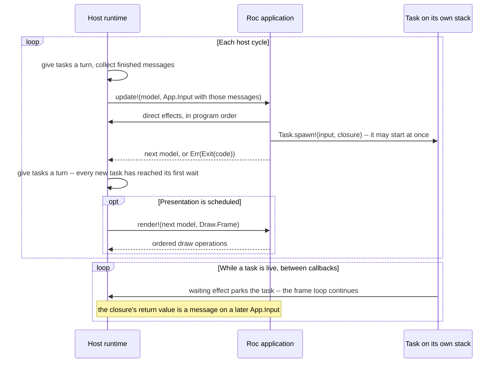

# RocRay architecture

## Purpose of this document

This document defines RocRay's intended end-state architecture. It is a design
contract: the stable requirements, system boundaries, invariants, and reasons
that should govern both the current implementation and future features.

It is not an API reference, implementation tour, test inventory, or delivery
plan. Those change as the project develops. Public module documentation
describes the current API, [`CONTRIBUTING.md`](CONTRIBUTING.md) describes the
current implementation workflow, and the
[GitHub issues](https://github.com/lukewilliamboswell/roc-ray/issues) describe
candidate work and delivery order.

This document should change only when a requirement changes, experience
invalidates an assumption, or the project deliberately moves a system
boundary. Adding a draw primitive, input source, effect, resource type, or
target should not by itself require an architecture change.

## Product definition

RocRay is a focused Roc application platform for games, visualizations,
creative tools, explainers, and other interactive or frame-oriented programs.
It supplies graphics, audio, input, window or surface management, capture, and
selected access to external systems through a disciplined boundary between a
Roc application and a host runtime.

RocRay is deliberately smaller than a game engine or application framework.
The application owns its model and domain rules. Libraries and application
code may build scene graphs, entity systems, UI toolkits, physics worlds,
network protocols, or asset pipelines, but the platform does not prescribe or
retain those abstractions. Its job is to make host facilities safe, explicit,
bounded, testable, and efficient.

The current host uses raylib, but raylib is an implementation dependency rather
than the application-facing architecture. A different native backend, a
browser callback loop, or a non-rendering test host must be able to preserve
the same application contract.

## Vocabulary and prior art

RocRay is closest to a state transducer embedded in a game loop. It is informed
by The Elm Architecture, but it is not a browser UI runtime: it samples several
host facilities together, changes device state through direct calls, and
renders immediately to a frame.

The vocabulary deliberately follows established meanings:

| RocRay term | Meaning |
| --- | --- |
| `Model` | Application-owned state retained between host cycles |
| `App.Input(msg)` | Everything supplied to one cycle: sampled host state, interval events, and task messages |
| `update!` | The effectful step that folds one input into the next model |
| effect | A direct host call made from an application callback or a task |
| waiting effect | An effect that can wait on the outside world; on a task it parks the task rather than the frame |
| queued effect | An effect that hands a bounded payload to a host-owned queue and returns at once; the host drains the queue off the frame thread |
| task | Scheduled work with a lifecycle: an effectful closure started by `Task.spawn!`, running on its own stack until it returns one message |
| application `Message` or `msg` | The value a finished task returns, delivered in a later `Input` |
| phase | Which application callback the host is inside; every effect states the phases in which it is legal |
| `Draw.Frame` | Render-scoped authority for the active drawing surface |
| host cycle | One `App.Input`, one call to `update!`, and optional presentation |
| simulation step | Application-defined domain advancement performed zero or more times within one `update!` |
| presentation frame | One call to `render!` using the latest model |

Names are selected by direction, timing, cardinality, and ownership rather than
by the current implementation. A familiar term is preferred when it predicts
those properties; a qualified familiar term is preferred to a novel one when
two domains use the same word differently. This is the terminology test for
future concepts as well as the rationale for the current names.

Several words have precise meanings throughout this document:

| Word | Meaning here |
| --- | --- |
| bounded | The maximum host-retained items or bytes is known before admission; it need not be small or globally constant |
| capability | An unforgeable typed value granting limited authority over a host facility or resource; possession does not guarantee a successful runtime outcome |
| domain state | Application-meaningful state that determines behavior or policy, as distinct from a host facility's operational state |
| orderly lifetime | The span from a successful `init!` to the cycle that ends the application; guarantees about delivery hold within it and not across forced termination |

The names also account for conventions that conflict across software domains:

- [The Elm Architecture](https://guide.elm-lang.org/architecture/) uses
  `Model`, `update`, and messages. RocRay keeps those names where the meanings
  match: one model, one place per cycle where it changes, and messages that
  arrive as data. It does not keep Elm's purity: RocRay's `update!` calls host
  effects directly, so the `!` is part of the name.
- In mainstream async APIs, such as
  [Python `asyncio`](https://docs.python.org/3/library/asyncio-task.html#awaitables)
  and structured-concurrency libraries generally, a *task* is scheduled or
  running work with a lifecycle: it starts, it may wait, it can be cancelled,
  and it finishes with a value. That is precisely what `Task.spawn!` creates,
  so *task* predicts the right behavior.
- A *message* is conventionally a value delivered into a state machine's inbox
  rather than a call. RocRay messages arrive on `Input.messages` in the order
  their tasks finished and are consumed by exactly one `update!`, which is the
  intuition the word already carries.
- A *phase* names a stage of execution in which a different set of operations
  is legal. `Context` is avoided for this role because framework contexts
  usually carry capabilities or services, whereas a RocRay phase is host state
  the application never holds.
- A *step* conventionally suggests advancing a simulation. Game loops often
  distinguish variable-rate frame processing from fixed-rate physics steps, as
  illustrated by
  [Godot's processing model](https://docs.godotengine.org/en/4.6/tutorials/scripting/idle_and_physics_processing.html).
  One RocRay cycle may cause the application to perform zero, one, or several
  simulation steps, so the value supplied to `update!` is an *input*, not a
  `Step`.

`Step`, `Action`, and `Update` therefore name different concepts elsewhere and
are not used for these public roles.

## Design goals

### Simple application reasoning

An application should be understandable as a model transformed by a stream of
complete observations. There is one place per cycle where domain state changes
and no hidden platform callback that can mutate the model. Work that finishes
later reports back as data, not as a callback into application state.

### Testability and controlled reproducibility

Application rules should be testable without a window, GPU, audio device,
filesystem, network, or coroutine. Sources of nondeterminism must cross the
application boundary explicitly so an application can replace, record, or
control them when reproducibility matters. Because `update!` is effectful, the
platform makes the *pure core* of an application testable rather than `update!`
itself: inputs and host resources have pure constructors, so decisions folded
out of `update!` can be exercised directly.

### Frame-time discipline under load

Filesystem, network, process, and waiting operations do not run inside
`update!` or `render!`. They run on a task, where waiting parks that task and
the frame loop continues. The amount of synchronous work introduced by the
platform is bounded before it is admitted. Frame-scoped GPU and audio calls can
still stall in a driver, so RocRay does not claim hard real-time deadlines.
Saturation has deliberate semantics rather than causing unbounded retained
work or silent message loss.

### Efficient boundary crossings

The expensive unit is often a Roc/host transition, allocation, copy, or stack
switch rather than the primitive operation behind it. APIs should move compact
batches and snapshots across the boundary and let each side loop over the
representation it owns.

### Honest portability

The application contract must not assume who drives the event loop or how the
host schedules work. A target exposes an explicit capability profile. Features
with no sound implementation on that target are absent from its profile rather
than accepted and failed mysteriously at runtime.

When these goals conflict, correctness, explicit ownership, boundedness, and
clear semantics take priority over API breadth and peak benchmark results.

## The system boundary

Ownership has two meanings at this boundary. *Semantic authority* means deciding
what a value means and how it changes. *Runtime custody* means retaining its
representation and eventually releasing it. The two must not be conflated.

Each layer has a distinct responsibility:

| Layer | Semantic authority | Runtime custody |
| --- | --- | --- |
| Roc application | Domain model, policy, interpretation of input, what work to start | Ordinary Roc values reachable from the model and from a task closure |
| Reusable Roc packages | Reusable vocabulary, algorithms, and caller-injected effect interfaces | Their ordinary values and synchronous delegated calls, but no live host facility merely by defining its type |
| Platform adapter | Public input, effect, task, and frame protocols | Values moving between the application and host ABI |
| Host runtime | Cycle ordering, sampling policy, phase enforcement, task scheduling, capacity, shutdown | The opaque model between callbacks, undelivered task messages, and native resources |
| Backend and operating system | Device and operating-system behavior | Windows or surfaces, files, processes, sockets, GPU state, and audio state |

The application has semantic authority over its model. The host has custody of
the model between callbacks but treats it as opaque. It does not inspect the
model to infer rendering, input interest, resource reachability, or domain
decisions.

Internal transport records, task envelopes, resource slots, native pointers,
and backend objects do not cross the public boundary. Public opaque values are
typed capabilities, not escape hatches into host memory.

## The application contract

A RocRay program has three responsibilities:

- `init!` validates startup configuration, performs one-time startup effects,
  and creates the initial model. Startup may load or allocate resources, and
  may use waiting effects, before interactive cycling begins.
- `update!` receives the current model and one `App.Input`. It folds that input
  into the next model, calls host effects directly, and starts tasks. It
  returns the next model, or `Err(Exit(code))` to stop the application.
- `render!` receives the resulting model and a `Draw.Frame`. It may issue
  drawing commands and frame-scoped draw-state changes, but it cannot change
  the model or reach general host work.

Conceptually, the host drives this cycle:

The ordering is intentional: the host constructs one input, `update!` runs
exactly once against it, and any presentation sees the model that call
returned. A host may implement this with a native loop, a browser callback, or
another scheduler; the observable contract remains the same.

### Host cycles, simulation steps, and presentation

A host cycle supplies one fresh `App.Input` and invokes `update!` exactly once.
The host may then invoke `render!` at most once with the resulting model. A
graphical host normally presents every cycle; a headless, minimized, or
deliberately throttled host may omit presentation.

A simulation step is application-defined rather than a platform callback. An
application may advance its domain simulation zero, one, or several times
during one `update!`. Only the final model is available for presentation.

The host does not invoke `update!` repeatedly with the same input to catch up.
Each interval event and task message is therefore consumed by exactly one call.
Simulation pacing, catch-up limits, and overload policy remain explicit
application policy.

The platform cannot prevent application code from taking too long. It can and
does prevent `update!` and `render!` from becoming blocking I/O entry points:
every effect that can wait is refused in those phases. Work that waits belongs
on a task and answers on a later cycle.

## Invariants

These properties are the architecture. A change that weakens one of them is an
architecture change, not a feature.

1. **One Roc thread.** Every application callback and every task body runs on
   the frame thread, one at a time. The host never runs Roc code on a worker
   thread and never shares a Roc value with one. Host workers see bytes the
   host owns, never Roc values.
2. **The model changes in one place.** `update!` is the only callback that
   returns a new model. A task cannot read or write the model; it computes a
   value and returns it.
3. **Tasks report by message.** During an orderly lifetime a task delivers
   exactly one message, on `Input.messages`, and never delivers again. Messages
   arrive in the order their tasks finished; the order they were spawned in
   does not constrain that.
4. **Waiting happens only in startup or on a task.** No effect reachable from
   `update!` or `render!` may wait on the filesystem, the network, a device, a
   peer, or the clock, for any length of time. An effect that only hands
   bytes to a bounded queue does not wait; when the queue is full it says so.
5. **Live tasks are bounded, and spawning never fails.** A fixed number of
   tasks run at once; each owns a stack, which is what the bound is really
   bounding. A spawn past that limit is queued and started in submission order
   as a slot frees. `Task.spawn!` has no failure to report, so a refusal would
   have to be a silently dropped closure that never answers.
6. **Scheduling is cooperative.** A task yields only at a waiting effect. Long
   pure computation inside a task holds the frame exactly as it would inside
   `update!`; the platform buys overlap for waiting, not for computing.
7. **Shutdown cancels and drains.** No `Input` exists after the last cycle, so
   nothing produced afterwards can be delivered. Live tasks are cancelled,
   closures that never started are dropped, and staged messages are released
   rather than leaked. A task parked on the event loop -- a socket, a timer --
   returns at once on the cancelled path. A task parked on work already
   running on a host worker -- a file write, an image encode, a database
   query -- cannot be unwound from outside: that work is bounded by the
   payload it was admitted with, and the host either lets it finish or
   interrupts it through the facility's own mechanism before tearing tasks
   down. Queued effects are drained before the process exits, bounded by
   each queue's capacity. Forced process termination is outside this
   guarantee.
8. **A phase violation is a programmer error.** Every effect declares the
   phases it is legal in. Reaching one from another phase fails immediately,
   naming the effect, the phase it was called from, and where it belongs.
9. **Rendering draws and may annotate diagnostics.** `render!` cannot change
   the model, change operational host state, or start work. Its only
   non-drawing effects are one-way diagnostic annotations: they cannot report
   recorder state or admission, influence drawing, or become application
   input. Anything that must affect the next model has a representation in
   `App.Input`.

## Boundary protocols

The application and host interact through four explicit protocols. They are
separate because they have different direction, timing, cardinality, and
failure semantics.

| Protocol | Direction | Timing and cardinality |
| --- | --- | --- |
| Startup authority | Host to `init!`, with direct startup operations | Once, before cycling |
| `App.Input(msg)` | Host to `update!` | Exactly once per host cycle |
| Effects | Application to host, in program order | Any number, synchronously, from the phases each effect permits |
| `Draw.Frame` | Host to `render!`, with draw calls back to host | Zero or one per host cycle; exactly one per presentation frame |

Adding a fifth protocol is an architecture change. Adding a new value carried
by one of these protocols is ordinarily an API change only.

### Input: `App.Input(msg)`

`Input` is immutable data supplied to one call of `update!`. It contains three
kinds of information, which are not falsely presented as one atomic operating-
system snapshot:

- **state samples** report the latest value at the cycle boundary, such as
  held keys, surface dimensions, focus, and recording status;
- **interval events** report ordered occurrences retained since the preceding
  input, such as presses, text, dropped files, or touch transitions;
- **messages** are the values finished tasks returned, in completion order.

The contained keyboard, pointer, touch, and gamepad snapshot is named
`devices`, not `input`. This keeps `App.Input` distinct from one category
inside it and avoids the unhelpful expression `input.input` in application
code.

Every input field documents which kind it is, when it is sampled, its ordering
and coalescing rules, and its finite capacity. A bounded event source either
reports overflow explicitly or documents that it is intentionally lossy and
what is coalesced. "Latest value" is sufficient for state; silently losing an
edge or a message is not equivalent.

The `devices` snapshot is where the two kinds meet, and its fields are
classified as follows. On the desktop host the interval events are recorded by
the host's own callbacks, chained behind raylib's on the window: raylib keeps
levels, not queues -- its key and mouse-button callbacks store the latest
action, its scroll callback overwrites the wheel, and its character queue holds
sixteen per poll -- so anything that happened between two polls would collapse
into whatever came last. Recording at the callback is what makes the guarantee
below hold independently of frame timing.

| Field | Kind | Source | Capacity and coalescing |
| --- | --- | --- | --- |
| `keys` held bit, `mouse` held bits, `mouse` position and delta | State sample | raylib's level at the cycle boundary | Latest value |
| `events` | Interval event | Window-system key, mouse-button, scroll and character callbacks | 256 per interval, in delivery order across all four sources, each click with the pointer position it landed at; `events_overflow` set when more arrived and the rest were discarded; auto-repeat is not an event |
| `keys` and `mouse.buttons` pressed and released bits | Interval event, coalesced | The same callbacks | Per key or button, at least one press and at least one release since the previous input; several of one key coalesce into one bit. The bits coalesce; the list does not |
| `mouse` wheel | Interval event, coalesced | Window-system scroll callback | Every notch in the interval summed; each notch is also an `events` entry |
| `text_input` | Interval event | Window-system character callback | 32 codepoints in the order typed; `text_input_overflow` set when more arrived and the rest were discarded; each character is also an `events` entry, ordered relative to the key edges around it |
| `gamepads` held bits and axes | State sample | raylib's per-cycle gamepad poll | Latest value |
| `gamepads` pressed and released bits | Sampled edge | Comparison of two consecutive polls | Intentionally lossy: a press and release between two polls is not seen; there is no callback to record from, and gamepads never appear in `events` |

The guarantee this gives an application is that every key, mouse-button,
scroll and character event that reaches the process is delivered in the next
`Input`, in order, with count and (for clicks) position preserved up to the
stated capacity, or reported as overflow -- never silently lost -- with a
latency of at most one cycle. `events` is the authoritative record; the
packed bits, the wheel sum and `text_input` are coalesced conveniences
derived alongside it, and they keep recording when the list is full, so the
coalesced view is complete even on an interval whose list overflowed. A key
tapped between two cycles is pressed and released in one input and held in
neither; a button released and pressed again between two cycles is released
and pressed in one input and held in both; two taps are two pairs of events
and one pair of bits. Gamepad buttons carry no such guarantee and say so.

A scripted keyboard (`Keys.set_source!`, `--host-keys`) is the same derivation
over a scripted level, with a scripted tap recorded as an edge inside the
cycle, so a headless or windowed test can state the between-polls case that a
level per cycle could never express. Scripted input feeds `events` too -- a
tap as a press and a release, a held-set change as the edge it implies, typed
text as characters in script order -- and hardware events are shut out
entirely, device by device, while a script is that device's source.

`App.Input(msg)` is also the type witness that ties a task's message to the
application's own `Msg`. Only the platform's entry module can name the
`requires` bound, so any public function whose signature mentions `msg` and
reaches a hosted effect takes an input it never reads. Without it, `msg`
generalizes at the call site and the host decodes the returned bytes at a
different type.

Continuously changing sources have two valid shapes. Ambient sources such as
device input are sampled or buffered into `Input`. Demand-driven sources such
as a socket or database cursor can instead expose a repeated waiting effect
inside a task. Because a task delivers one message, a waiting effect on a
continuous source answers with a bounded batch -- everything that had arrived
by the time it woke, up to a stated cap -- rather than one item; a one-item
answer would cap the source at one item per cycle. Neither shape invokes
application code from a background thread.

### Effects

An effect is a direct host call. There are three kinds, distinguished by
whether the call can wait and by where the work is done.

A *synchronous* effect — setting the cursor, resizing the window, playing a
sound, uploading pixels, starting a recording, reading the clock — changes host
state or answers a question in program order at the point it is written, from
`init!`, `update!`, or a task. It does not wait, and it is not available to
`render!`, which draws.

A *waiting* effect — a file read, a request, a query, a receive, a sleep — may
wait on the outside world. It is legal in `init!`, where it blocks startup
deliberately, and on a task, where it parks that task.

A *queued* effect — writing to standard output, sending a datagram — hands a
bounded payload to a queue the host owns and returns at once. The host drains
that queue off the frame thread, on bytes it owns and never on a Roc value.
Order within one queue is preserved, a payload is queued whole or not at all,
and saturation is a typed result rather than a wait or a silent drop. The
eventual outcome of the drained work is not observable from the call; an
application that must act on that outcome uses a waiting form from a task. It
is legal in `init!`, `update!`, and a task. A queued effect is how a
"fire and forget" facility — a log sink, a metrics feed, streamed audio, a
datagram — reaches the outside world without giving a frame something to wait
on.

An effect's verb states the strength of its guarantee. `Set` is reserved for a
state change the capability profile promises to apply; a window-manager hint,
for example, is named `Suggest` rather than pretending the host controls the
final geometry. If success or failure itself changes application policy, the
effect returns a typed result or the condition appears in a later `App.Input`.

Invoking an effect and observing a physical outcome are different guarantees.
Device effects can be subject to documented backend behavior, but a condition
the model must distinguish must be observable — as a returned value or as
input — rather than silently absorbed.

### Tasks

A task is an effectful closure handed to `Task.spawn!` from `update!` or from
another task. The host runs it on its own stack. A waiting effect inside it
parks that stack; the frame loop resumes and keeps rendering, and a later cycle
resumes the task where it left off. When the closure returns, its value is
staged and delivered as a message on the next `App.Input`.

When a task starts is the host's choice: it may run up to its first waiting
effect before `Task.spawn!` returns, or in the host's turn after `update!`
returns. Either way it has reached its first wait, or finished, before
`render!` of the same cycle. A task's code and its synchronous effects can
therefore interleave with the rest of the `update!` that spawned it, and
application code must not assume an order between the two. The only ordering
a task promises is its message: on a later cycle, after every task that
finished before it.

This is what makes a multi-step operation readable: inside a task, a waiting
effect returns its answer, so a load-then-parse-then-fetch sequence is
straight-line code with ordinary error propagation rather than a state machine
spread across message variants.

Tasks buy overlap for waiting only. They are not a general concurrency
facility: the application never observes two of its own callbacks running at
once, never needs a lock, and never has to reason about a partially updated
model. The cost of that simplicity is invariant 6 — a task that computes
without waiting holds the frame.

Because a task cannot touch the model, the only thing it can say is its message.
An operation whose outcome must change application policy therefore returns
that outcome in the message; a task that returns nothing useful is a task whose
completion the model cannot account for.

### Rendering: `Draw.Frame`

`Frame` is a render-scoped capability rather than general application input.
It permits ordered drawing and draw-state changes only while the host's current
surface scope is open.

Rendering may query narrowly frame-relative facts such as the dimensions of
the active surface or metrics of a draw resource. Such a query may influence
drawing only. Anything that must affect the next model, hit testing, or host
state also needs a representation in `App.Input`.

Rendering may also emit bounded, one-way diagnostic annotations. These use the
ordinary effect protocol and are the sole non-drawing effects permitted during
`render!`. They expose no recorder status, timestamp, admission result, or
control operation, and therefore cannot make application behavior depend on a
diagnostic sink.

Diagnostic evidence must distinguish a measured zero from evidence that was
not captured. Every measurement family has an explicit completeness state;
loss, disabled detail, unsupported facilities, and unfinished recording remain
different states. Author-facing analysis may draw a conclusion only from
complete evidence, and must report partial or unavailable evidence instead of
turning missing rows into a claim that no work occurred. Timing names describe
the boundary actually measured and never attribute an indivisible host interval
to application code, a worker, presentation, or a device by inference.

### Choosing where work goes

| Need | Mechanism |
| --- | --- |
| Latest ambient state or bounded interval events | `App.Input` field |
| An immediate host state change with no waiting | Synchronous effect called from `update!` |
| Bytes out, where only saturation need be observed | Queued effect called from `update!` |
| Work that waits, and whose outcome matters | Task, reporting one message |
| Drawing or draw state ordered within a frame | `render!` and `Draw.Frame` |
| One-way diagnostic annotation | Effect from any application callback or task |
| One-time load or allocation before the first frame | `init!` startup authority |

The classification follows semantics, not backend convenience. An operating-
system function being synchronous does not make it safe to expose as a
frame-phase effect.

## Phases and enforcement

Capabilities can outlive the callback that supplied them, so possession of a
value is not authority to use it in every phase. The host therefore tracks
which callback it is inside — `init!`, `update!`, `render!`, a task, or none —
and checks every hosted operation against the set of phases that operation
declares. The sets are few, and are stated as rules rather than as a list of
functions:

- Anything that **changes host state** or **queues bytes** is legal in
  `init!`, `update!`, and a task, and refused in `render!`.
- Anything that **draws** is legal only in `render!`, inside the frame scope
  the host opens around it.
- A **one-way diagnostic annotation** is legal in every application callback
  and a task. It may copy only a bounded diagnostic payload into host-owned
  recording storage and cannot expose admission or operational state.
- Anything that **waits** is legal only in `init!`, where it blocks startup
  deliberately, and on a task, where it parks that task.
- **Starting a task** is legal in `update!` and in another task. It is refused
  in `init!`, which never sees the answering input, and in `render!`.
- A few genuinely **constant-time queries** with nothing to allocate and no I/O
  to do are legal in any callback. Anything that copies, allocates, writes, or
  reaches a driver does not belong in that set.

This runtime guard replaces a type-level purity guarantee. It buys direct,
readable effect calls and straight-line tasks; it costs a class of error that
the compiler does not catch. The trade is deliberate, and it is why
violations fail loudly and immediately, in application vocabulary, naming the
effect, the phase it was reached from, and the phase it belongs in.

A waiting effect saves and clears the phase across its park and restores it on
resume, because the frame loop runs in between and enters phases of its own. A
task therefore always observes its own phase, however many cycles it waited.

There is no phase-free escape hatch. A read needed by model logic is input, an
effect, or a task message. A read meaningful only for drawing belongs to
`Draw.Frame`. Startup-only facts belong to startup. A fact `init!` needs that
the world supplies — the clock, entropy, arguments — is an effect, because
`init!` receives no `Input`; an input field alone would leave startup without
it. Implementation cost does not decide semantic placement.

## State, resources, and ownership

The application model has semantic authority over ordinary Roc data. The host
has semantic authority and runtime custody for native resources. When the
application needs to refer to one, it holds a typed opaque capability whose Roc
ARC lifetime pins a validated host-owned slot.

The resource contract is:

- only the host can manufacture a live handle;
- handle kinds cannot be confused;
- copying a handle shares ownership rather than copying the native resource;
- the final Roc reference retires the resource exactly once;
- using a released, forged, or wrong-kind handle cannot reach native memory;
- memory and resource safety never depend on remembering a manual `close` or
  `unload` operation;
- orderly shutdown releases every remaining host resource.

Automatic reclamation does not prohibit semantic lifecycle operations. A
socket may be half-closed, a transaction committed or rolled back, a process
stopped and awaited, or an encoder finished while its handle remains live.
Those are effects with domain meaning. Final ARC release remains the safe
cleanup path when no explicit lifecycle operation occurred.

Native destruction may call a GPU driver, audio device, filesystem, process,
or network stack, so ARC release records retirement rather than performing
unbounded destruction inside application work. The host drains retired
resources at safe, bounded points. A resource remains unavailable for reuse
until destruction has actually completed.

Some completed work naturally becomes ordinary Roc data rather than a public
handle. The host may transfer ownership of its backing allocation directly
into a Roc list or string when the ARC and allocator contracts make that safe.
The public ownership rule is then ordinary value reachability: retaining a
slice may retain the whole allocation, and an explicit copy is how an
application releases excess capacity. This optimization must not change the
value's semantics.

A task closure is an ordinary Roc value: it captures what it needs, the host
owns it from the moment it is spawned, and it is released when the task
finishes, when it is cancelled, or when it is dropped from the pending queue at
shutdown. A message that was produced but never delivered is released the same
way.

The model remains the only semantic authority for application domain state. A
database, socket, process, or stream handle denotes host-owned operational
state; it is not permission for the host to mutate the model or call
application code in the background.

## Bounded work and backpressure

Every platform-owned resource-bearing path has a bound established before work
is admitted. A bound may be fixed by the capability profile, configured during
startup, negotiated when a resource is created, or derived from the size of an
explicit value submitted by the application. This includes at least live tasks,
message staging, native resource heaps, input and stream buffers, file and
network payloads, capture buffers, per-cycle uploads, scoped draw stacks, and
deferred destruction.

Bounded does not mean every application-supplied quantity is capped at a small
platform constant. What is bounded is what the host *starts*, because that is
what costs a stack, a socket, or a file descriptor. A queue of not-yet-started
task closures is proportional to spawns the application itself chose to make,
in the same way that traversing a list returned by the application is
proportional to a list it chose to build. There are no implicitly unbounded
retained caches, registries, or background worker sets.

For each bound, the implementation defines:

- what is counted and who owns it;
- when capacity is reserved and released;
- what happens at saturation;
- whether work may be retried and how the application observes that;
- the maximum payload retained while waiting;
- shutdown and cancellation behavior.

A limit is not merely an implementation constant: its exact value may change,
but its unit and saturation semantics are part of the public contract when
applications can observe them. Task saturation is expressed as delayed start in
submission order, never as a dropped closure, because a dropped closure is an
answer that never comes. An effect that cannot proceed returns a typed outcome;
saturation is not represented as a silent no-op.

Batching is preferred where it reduces boundary crossings without hiding
backpressure. A list of draw instances, tile commands, samples, or upload
regions should normally cross once and be traversed on the host side. Batches
still have explicit size and lifetime bounds.

## Error policy

The platform distinguishes programmer errors from runtime outcomes by where
the relevant fact comes from.

A programmer error violates an invariant determined entirely by the submitted
value, its types, the current phase, and the live capabilities already held by
the application — calling an effect from the wrong phase, supplying internally
inconsistent dimensions, using a capability for the wrong operation. Prefer
types and constructors that make such values unrepresentable. Remaining
violations fail the application promptly, with a message written in the
application's own vocabulary rather than the host's.

A runtime outcome depends on mutable state outside the submitted value:
capacity currently in use, filesystem contents, permissions, a peer, a child
process, a device, a driver, or scheduling. Capacity exhaustion, missing files,
denied permissions, network failures, process exits, recoverable device loss,
and invalid external input therefore produce typed results from effects, typed
values inside task messages, or documented status in `App.Input`. They do not
corrupt state, grow memory without bound, or silently consume a message.

An external side effect may have occurred even when its outcome is an error.
Safe retry and idempotency remain application or protocol policy; the platform
does not retry on the application's behalf.

The platform does not guess repairs that change application meaning. It does
not silently substitute resources, reinterpret malformed data, invent paths,
retry non-idempotent operations, or downgrade a requested capability.

## Time, nondeterminism, and capture

The enduring determinism guarantee is narrow and useful: all changing host
facts enter the model through explicit input or through task messages, so given
the same model, the same complete `App.Input`, and the same effect outcomes, an
application takes the same decisions.

Simulation time and wall time are distinct. Animation and physics use the
cycle's simulation timeline. Calendar time, external I/O, device input, task
completion order, and entropy are explicitly nondeterministic. Randomness used
by domain logic is represented by explicit generator state; startup entropy may
seed it when variation is wanted.

A reproducible run therefore controls or records:

- initial model and configuration;
- simulation-step sequence;
- real and virtual input;
- random seeds;
- resource bytes and platform versions;
- every task message that affects the model, and its delivery order.

Fixed-step capture controls simulation pacing; it does not make wall time,
network responses, microphone input, or GPU behavior across different devices
deterministic. Replay and capture claims state the environment over which they
hold rather than implying universal byte identity.

Virtual input travels through the same sampling path as physical input. A
scripted capture therefore exercises ordinary application logic instead of a
parallel test-only control path.

Capture is a host output facility, not part of application rendering policy.
The application selects a source surface, format, timing mode, destination
authority, and finite duration or stop condition. Encoding, readback, and file
ownership remain in the host and are subject to the same boundedness and error
rules as other external work.

## Rendering boundary

Rendering is immediate and derived from the current model. RocRay does not
retain or reconcile an application scene tree. The host retains only the
backend state and resources needed to execute the current ordered draw stream.

Frame and nested target scopes define where a draw lands. The active surface
may answer for its own dimensions and other geometry needed to interpret draw
coordinates. Application layout and interaction decisions still use the
corresponding `App.Input` data, so rendering does not become a second update.

Draw primitives, 2D or 3D cameras, meshes, text, shaders, and post-processing
are all extensions of this same ordered rendering boundary. Adding them does
not move scene ownership into the platform. Higher-level retained systems
belong in pure Roc packages unless a narrowly host-owned representation is
required for device or operating-system ownership, memory or concurrency
safety, or a measured boundary-performance need.

## External systems and authority

Filesystem access, networking, databases, subprocesses, clipboard access,
audio input, and similar facilities extend what the host can do, not how the
application model works.

Anything that waits is a waiting effect, used inside a task. An immediate
change to host state is an ordinary effect. Long-lived native state uses a
typed ARC handle. Continuously arriving bounded observations are sampled or
buffered into `App.Input`. Protocol state, serialization, retry policy,
queries, domain caching, and interpretation remain in Roc unless the host must
own a narrowly defined piece for device or operating-system ownership, memory
or concurrency safety, or a measured boundary-performance need.

Every external facility states its authority boundary. A write or capture
destination is confined to an application-selected root or capability. A
process capability states what executable and environment it may use. Network
and device capabilities state their platform permission behavior. The
platform does not turn a convenient feature into ambient, undocumented access
to the machine.

There is no arbitrary native-call facility. A closure the host retains,
schedules, parks, or resumes exists for exactly one purpose — the body of a
task — and a task runs on the frame thread under the same phase guard as every
other application code. Roc code may package an effectful delegate and invoke
it synchronously in the caller's current phase; scoped render callbacks have
the same immediate shape. The host never retains or schedules such a delegate,
and the underlying hosted effect still performs the phase check. No API accepts
a closure the host will run at an unspecified time, on an unspecified thread,
or outside a phase. New host work is represented by a typed effect, waiting
effect, input field, render operation, or startup capability.

## Targets and capability profiles

The core contract does not assume a blocking native main loop. The host may
drive cycles from a desktop loop, a browser callback, a test harness, or a
future platform scheduler. What each must supply is a way to run a task's
suspended stack and resume it later without moving Roc code to another thread.

Each released target declares a capability profile. A target may implement a
strict subset of facilities — for example, a browser need not expose native
subprocesses or unrestricted files — but every included facility preserves its
documented semantics. A structurally unsupported facility is absent at build
time or excluded by selecting a narrower platform bundle; a native bundle
otherwise carries every facility, including the libraries behind them, and
applications pay for what they link rather than choosing a subset. A facility present
in the profile may still be unavailable at runtime because of mutable facts
such as permissions, connected devices, capacity, or external failures; those
are ordinary typed outcomes, not evidence that the capability profile lied.

An application is portable across the profiles whose shared capabilities it
uses. Pure packages remain portable regardless of host profile. A package that
accepts an injected effect interface is portable across the profiles that
provide that complete interface; it cannot turn a missing target capability
into a no-op. Target-specific optimizations and backend objects stay below the
platform boundary.

A non-rendering headless host is a semantic test backend, not a pixel-accurate
renderer. It preserves the host cycle, effect and task behavior, resource
ownership, and controlled observations that do not require a real device.
Pixel behavior is verified against graphical backends separately.

## Shared package vocabulary and effect interfaces

Reusable Roc packages need to name common values without acquiring host
authority. The companion package therefore owns shared vocabulary such as
colors, vectors, input snapshots, time values, cameras, and descriptive parts
of resource handles. It may also own opaque effect interfaces whose
implementations an application platform injects. Defining or importing one of
those interfaces manufactures no host authority; only the platform-configured
value can reach a hosted effect.

The platform re-exports every companion nominal that appears in its public API
as the same nominal, not a wrapper. Applications can depend only on the
platform while reusable packages depend on the shared package, and values and
effect handles cross that package boundary without conversion or loss of type
identity. An application never adds a second direct dependency on the companion
package.

The companion package contains no hosted declarations, cannot manufacture live
resources, and cannot acquire a callback capability such as `Draw.Frame`.
Package-owned effect receivers invoke only the functions supplied by their
configured handle, synchronously. Every underlying hosted operation preserves
its phase, timing, ordering, bounds, ownership, and typed outcomes. A target can
construct only the effect interfaces supported by its declared capability
profile; it does not fill unsupported operations with no-ops.

The platform pins a compatible published companion version so a release cannot
refer to an unavailable or structurally different vocabulary or interface
build.

## Verification obligations

Architectural claims are upheld by executable checks wherever possible. The
names and locations of checks may change, but the verification layers do not:

- **Pure tests over the application's own core.** `roc test` cannot call
  `update!`, so the platform supplies what makes the decisions inside it
  testable: `App.Input.for_tests` builds a neutral input with per-field
  `with_*` receivers, and every host resource has a resource-free `stub`, so a
  model full of assets can be written down in an `expect`. Applications are
  expected to keep a pure core — which message to fold in, whether to quit,
  what work to start — and let `update!` perform its decisions.
- **Compile-fail fixtures** prove that applications cannot import transport
  modules, manufacture capabilities, or name a removed API.
- **Host tests** cover phase enforcement, typed resource identity,
  ownership-transfer paths with adversarial alias, slice, and drop orders,
  bounded saturation, staged-but-undelivered message release, and shutdown.
- **Task behavior tests.** One end-to-end application spawns a task per message
  variant and fails unless every message returns with the right tag and
  payload, which is what keeps the `msg`-witness rule honest. Another spawns
  far more tasks than may run at once and fails unless all of them are started
  and accounted for, which is what keeps the cap a queue rather than a refusal.
- **Headless runs of every example** exercise startup, cycling, task delivery,
  and shutdown without a display. `ROC_RAY_TRACE_TASKS` adds a per-task trace —
  spawn, queue, park, resume, finish, deliver — so a run can assert on
  scheduling behavior and not only on the final state.
- **Graphical smoke tests** verify representative pixels and nested render
  scopes on a real rendering backend.
- **Packaged examples** are checked and exercised in the same dependency shape
  in which applications consume a release.

A property that is intended but not yet checked is described as an unverified
design goal, not as an established guarantee.

## Deliberate non-goals

RocRay does not provide:

- a retained scene graph, entity-component system, game editor, domain model,
  or mandatory asset build pipeline;
- concurrent application callbacks, parallel execution of Roc code, or blocking
  I/O inside `update!` or `render!`;
- a general asynchronous Roc runtime — tasks overlap waiting, not computation,
  and are not offered as a way to use more than one core;
- hidden mutable application state in the host;
- public transport tickets, native pointers, untyped resource IDs, arbitrary
  FFI, or any facility that runs an application closure outside a task and its
  phase guard;
- an implicit promise that every target supports every host capability;
- universal deterministic output in the presence of uncontrolled external
  input, task completion ordering, clocks, devices, or backend differences.

These boundaries do not exclude networking, databases, subprocesses, 3D
rendering, audio input, runtime resource loading, or a web host. They determine
the shape those features must take. Likewise, a future subscription API may
provide ergonomics for a continuous source, but its implementation must still
use effects and tasks for explicit lifecycle work and bounded `App.Input`
observations. It does not add a background callback protocol and does not let a
task deliver more than once.

## Evaluating changes

A platform proposal should answer these questions before its public API is
chosen:

1. Which RocRay use case and requirement does it serve, and which policy stays
   in the application or a package?
2. Which existing boundary protocol carries each value, instruction, and
   result?
3. In which phases is every host operation legal, and can it wait?
4. Who owns every value, native resource, stack, queue entry, and closure, and
   when is each released?
5. What is bounded, in what unit, and what happens at saturation and shutdown?
6. Which errors are programmer errors and which are runtime data?
7. How does the feature affect replay, capture, and completion ordering?
8. Which capability profiles can implement the same semantics, and what
   authority does the feature grant?
9. Which executable checks establish the contract?

If those answers fit the architecture above, the feature should normally
require API and implementation work, not an edit to this document.
